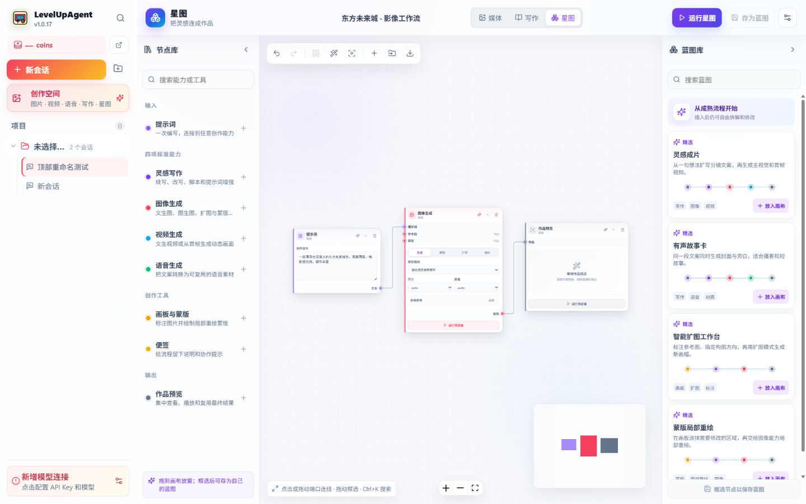
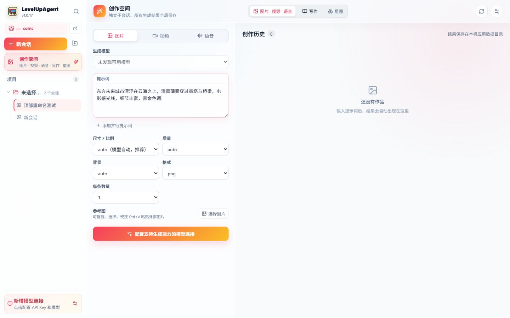

<div align="center">
  <p><strong>简体中文</strong> · <a href="README_EN.md">English</a></p>
  <a href="https://levelup.mom/"></a>
  <h1>LevelUpAgent</h1>
  <p><strong>一个工作区，连接每一种模型，也把灵感变成作品。</strong></p>
  <p>本地优先的桌面 AI 工作台：用 Agent 处理复杂任务，用创作空间生成媒体，用星图蓝图把流程保存下来反复复用。</p>
  <p>
    <a href="#快速开始">快速开始</a> ·
    <a href="#先看它在做什么">产品一览</a> ·
    <a href="#安全与隐私">安全与隐私</a> ·
    <a href="#文档">文档</a> ·
    <a href="https://levelup.mom/">LevelUpAPI</a>
  </p>
  <p>
    
    
    
    <a href="LICENSE"></a>
  </p>
</div>

---

## 先看它在做什么

### Agent 工作台

把项目文件、参考资料、命令、MCP、Skills、Git 审查和长任务放在一个可追踪的会话里。每个有副作用的动作都经过权限和审批边界。

### 创作空间

图片、视频、语音和写作拥有独立的参数与历史。支持参考图、多提示词并行、扩图、局部重绘、透明 PNG 蒙版和结果复用。

### 星图蓝图

把四项标准能力（写作、图像、视频、语音）连接成类型安全的 DAG。框选节点即可保存为自己的蓝图，插入后仍能自由拆解、重排和重连。





更多设计取舍和 Image Studio 对照见 [创作空间能力审计](docs/CREATIVE_STUDIO_AUDIT.md)，星图协议和交互细节见 [星图文档](docs/CONSTELLATION.md)。

## 快速开始

### 安装

从 GitHub Releases 下载对应平台的安装包。当前 `1.0.23` 已完成 Windows x64 本地构建验证；测试包未配置 Authenticode，Windows SmartScreen 可能提示“未知发布者”。

| 平台 | 包格式 | 状态 |
| --- | --- | --- |
| Windows x64 | NSIS `.exe` / MSI | 已构建、已冒烟验证 |
| Linux x64 | AppImage / DEB / RPM | 可从源码构建 |
| macOS Intel / Apple Silicon | DMG / App Bundle | 使用专用脚本构建 |

### 连接模型

1. 打开左下角 **新增模型连接**。
2. 为每个连接配置 Base URL、API Key、默认文字模型和生成协议；可信的本机/局域网服务可以显式允许无 Key。
3. 点击 **检测** 或直接输入模型 ID。标准 `/v1/models` 与 Gemini `/v1beta/models` 会独立发现。
4. 可添加多个连接并设置优先级；请求失败时会按健康记录和冷却策略自动故障转移。

LevelUpAgent 支持 LevelUpAPI，以及 OpenAI Responses、Chat Completions、Anthropic Messages 和 Gemini GenerateContent 兼容服务。API Key 只保存在系统凭据库，不写入网页存储。

### 第一次创作

1. 点击 **打开创作空间**，选择图片、视频、语音或写作。
2. 输入提示词并选择比例、质量、格式和参考图。
3. 需要组合流程时切换到 **星图**：从节点库添加能力，点击或拖动端口连线，运行后在作品预览节点查看结果。
4. 框选一组节点，点击 **存为蓝图**；以后从蓝图库插入即可复用。

## 能力地图

| 入口 | 适合的问题 | 关键能力 |
| --- | --- | --- |
| Agent 工作台 | “帮我完成一个需要文件、工具和判断的任务” | 项目上下文、审批、MCP、Skills、Goal、Git 审查 |
| 创作空间 | “我想快速生成、修改并管理媒体” | 图片/视频/语音、参考图、并行提示词、历史与预览 |
| 星图蓝图 | “我想把步骤连接起来，以后重复使用” | 类型化端口、DAG 执行、框选、批移、自动整理、蓝图导入导出 |
| 写作工作台 | “我想持续写完一本书、剧本或叙事项目” | 设定集、参考库、目标模式、版本快照、Yarn 导出 |

### 星图内置节点

- **提示词**：一次编写，连接到任意创作能力。
- **灵感写作**：续写、改写、脚本和提示词增强。
- **图像生成**：文生图、图生图、扩图和蒙版重绘。
- **视频生成 / 语音生成**：从文本或图像继续扩展作品。
- **画板与蒙版**：标注图片、绘制局部重绘区域并输出真实 PNG mask。
- **作品预览 / 便签**：集中查看结果，为流程留下说明。

常用快捷键：`Ctrl/Cmd + K` 搜索并添加节点，`Ctrl/Cmd + Enter` 运行，`Ctrl/Cmd + Z` 撤销，`Ctrl/Cmd + D` 复制选中节点，`F` 适应画布，`Esc` 停止运行。

## 安全与隐私

- API Key 使用 Windows Credential Manager、macOS Keychain 或 Linux Secret Service 保存。
- 写入、删除、命令、MCP 调用和补丁应用不会静默执行，均需要明确批准。
- 文件工具限制在工作区内，拒绝父目录穿越、危险符号链接和路径前缀逃逸。
- 请求日志不保存消息正文、附件、工具参数或 API Key。
- 只有你配置并选择的 Provider 会收到准备发送的消息和附件。

Shell 命令和本地 stdio MCP 进程仍拥有当前操作系统用户权限；LevelUpAgent 不把它们描述成系统级沙箱。完整边界见 [安全审计](docs/SECURITY_AUDIT.md)。

## 从源码运行

需要 Node.js 22+、pnpm 11+、Rust 1.85+ 和平台对应的 [Tauri prerequisites](https://v2.tauri.app/start/prerequisites/)。

```bash
pnpm install
pnpm tauri dev
```

只预览前端可运行 `pnpm dev`；Web 预览无法访问系统凭据库、目录选择器和本地工具。

### 中文代码与旧编码文件

工作区 `read_file`、`search_files` 会自动处理 UTF-8、UTF-16、GBK（GB2312）、GB18030、Big5、Shift-JIS、Windows-1252
等常见文本编码；编辑已有文件时，优先让 Agent 使用 `edit_file` 的精确替换。主机将保留原文件的
编码、BOM 和主导换行风格，并在目标编码无法表示新字符或文件疑似二进制时拒绝写入。新文件默认
使用 UTF-8；无 BOM 的旧编码（包括混合中日文代码页和缺少 NUL 特征的 UTF-16）无法唯一判断时，可给工具传
`encoding` 明确指定；已知采用旧代码页的工程中，纯 ASCII 文件也应在首次加入中文时显式指定。ASCII 在这些
编码中的原始字节相同，因此该提示不会重解释已有字符；含非 ASCII 字符且有效的 UTF-8 文件仍不能被提示改判。这个边界借鉴了
[Codex apply-patch](https://github.com/openai/codex/tree/main/codex-rs/apply-patch)、
[Claude Text Editor](https://docs.anthropic.com/en/docs/agents-and-tools/tool-use/text-editor-tool)
、Mozilla [`encoding_rs`](https://github.com/hsivonen/encoding_rs) 以及
[`chardetng`](https://github.com/hsivonen/chardetng) 的公开设计；实现与许可证说明见
[参考项目研究](docs/REFERENCE_RESEARCH.md) 和 [`THIRD_PARTY_NOTICES.md`](src-tauri/THIRD_PARTY_NOTICES.md)。
在 `agent` 自动权限下，明显会通过 shell 重定向（包括嵌套 shell）、`Set-Content`/`sc`/`ac`/`tee`、`git apply` 或格式化器改写文件的命令会先要求批准；
显式批准的命令仍由用户自行承担其工具默认编码。

### 验证与构建

```bash
pnpm check
pnpm build
cargo fmt --check
cargo test --manifest-path src-tauri/Cargo.toml
pnpm tauri build
```

macOS 安装包使用 `pnpm build:macos`。正式更新还需要仓库所有者配置 Tauri updater 密钥和签名证书。

## 文档

- [星图协议与交互](docs/CONSTELLATION.md)
- [创作空间能力审计](docs/CREATIVE_STUDIO_AUDIT.md)
- [架构与安全边界](docs/ARCHITECTURE.md)
- [安全审计](docs/SECURITY_AUDIT.md)
- [LevelUpAPI 兼容性证据](docs/LEVELUPAPI_COMPATIBILITY.md)
- [功能路线图](docs/ROADMAP.md)
- [发布与自动更新](docs/RELEASE.md)
- [参考项目研究](docs/REFERENCE_RESEARCH.md)

## 当前状态

`1.0.23` 是当前发布里程碑，修复“摇光残影”一键孵化准备与状态检查被 Harness 审批错误拦截的问题，并将应用自有 bootstrap 收紧到经过校验的 hatch-pet 清单、参考文档和两个必要脚本；伪造元数据、其他脚本及 Shell 拼接仍会进入正常审批边界。`1.0.22` 引入的自主求知链路保持不变，无需开始共学。Windows 安装包仍未配置 Authenticode，其他平台的正式发布以 CI 和签名配置为准。提交 Issue 时请附上复现步骤、应用日志和平台信息。

## 许可证

LevelUpAgent 以 [GNU Lesser General Public License v3.0 only](LICENSE) 发布；引用的 GPL v3 正文收录于 [LICENSE.GPL](LICENSE.GPL)。

Copyright © 2026 LevelUpAgent contributors.
