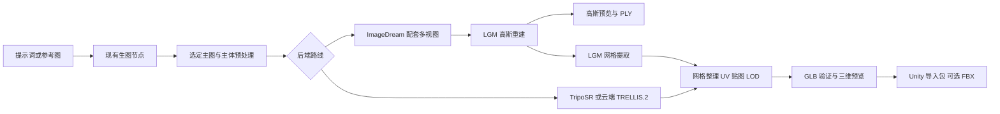

# LevelUpAgent 生模型工作流：高斯泼溅调研与实施计划

调研日期：2026-10-03（Asia/Shanghai）。产品代码基线：`6a8c77ec5778c60e4673be647da8121294d81e10`，`package.json` 版本 `1.1.65`。

后续推进：已增加 [可拆卸模块体积核算与验证工具](MODEL3D_MODULE_VALIDATION.md)，每步结果见 [验证日志](MODEL3D_VALIDATION_LOG.md)。本文保留初次调研的证据与路线判断；实际实现状态以后续日志为准。

用户目标：复用现有生图工作流，在 Agent 本地或 API 中转站云端生成 **Unity／游戏使用的网格资产**，包含 GLB／FBX、贴图，并探索“多视角生成 → 高斯泼溅 → 网格”的路径。

本文是调研与设计，未实现产品功能、安装推理环境、下载权重或执行付费生成。已核实本机为 **RTX 3080 Ti，12,288 MiB 显存**；云端硬件尚未指定。文中标注“官方”的性能数字来自上游，不能当作这台机器的实测。参考仓库、公开来源快照和提交锁定记录保存在 [`../../research/gaussian-splatting-study/`](../../research/gaussian-splatting-study/README.md)。

## 1. 结论与建议顺序

这条思路可行，但应把 **多视角生成、三维重建、游戏资产加工** 分成三个阶段。普通生图 API 分别生成正、侧、背面，不能保证它们符合一个共同的三维形状；高斯泼溅训练也不会自动修好互相矛盾的图片。

建议将产品能力命名为 **“生模型”**，提供“游戏网格”和“高斯展示”两种输出。默认选择游戏网格，后端保持可替换，不把最终产品绑定到一种三维表示。

| 优先级 | 路线 | 本项目用途 | 当前决策 |
| --- | --- | --- | --- |
| P0 | 现有生图 → TripoSR → 烘焙贴图／整理网格 → GLB | 12GB 本地基础链路与工程基线 | 先验证闭环；质量是基线，不声称最佳 |
| P0 | 现有生图 → ImageDream 四视图 → LGM → Gaussian PLY → LGM mesh conversion → GLB | 最贴近用户想法的高斯实验路线 | 与 TripoSR 同批样本比较；先用于研究评估 |
| P0 | 现有生图 → 云端 TRELLIS.2 → PBR GLB → Unity 整理 | 云端高质量候选 | 与本地路线公平比较后定默认；它不必经过高斯阶段 |
| P1 | 一致多视图 → InstantMesh 或适配过的重建器 → 网格 | 验证多视图是否改善形状 | 先跑 InstantMesh 自带 Zero123++ 配套流程 |
| P1 | 网格 → 几何约束的 MV-Adapter → 多视图贴图烘焙 | 增加风格控制、局部重新贴图 | 比直接将 MV-Adapter 塞入 LGM 更容易明确几何约束 |
| P1 | 真实环绕照片／视频 → OOOSplat／Brush → Gaussian PLY | 实物扫描与高斯展示 | 独立入口；不能混同为任意 AI 图片重建 |
| P2 | 多视图＋相机 → 2DGS／SuGaR → 网格 | 高斯表面重建研究 | 有许可与工程门槛，不设为首发必经阶段 |

**推荐先证明一个普通道具从现有图片资产变成可导入 Unity 的 GLB，再扩展复杂多视图与精修。** 第一版验收以静态道具为主；角色骨骼、蒙皮、表情、服装分层和可变形拓扑另列后续工作。

## 2. 为什么不能直接“多生几张图喂给高斯”

### 2.1 高斯泼溅表示的是外观场

经典 3DGS 使用大量带位置、协方差／尺度旋转、不透明度和颜色／球谐系数的高斯基元。通过已知相机的图像监督优化这些参数，实现快速新视角渲染。[P1]

它与游戏引擎中的三角网格不同：

| 资产性质 | 普通 Gaussian PLY | 游戏网格 GLB／FBX |
| --- | --- | --- |
| 三角面、连通拓扑、UV | 通常没有 | 通常需要 |
| 表面材质、可重新打光 | 原始辐射场不等于分离好的 PBR 材质 | 需要基础色、法线及相应材质属性 |
| 碰撞、导航、物理 | 需单独的代理几何或专门算法 | 可从网格派生，仍需简化与检查 |
| 骨骼动画 | 需专门的高斯动画／混合方法 | 需骨架、蒙皮权重及适当拓扑 |
| 文件格式判断 | `.ply` 可能是点云、高斯或网格，扩展名不足以区分 | 也需检查 GLB 中是否实际包含 mesh primitive |

PLY 改后缀、把高斯中心直接交给 Poisson，或把 PLY 装进一个 GLB 容器，都不能自动得到等质量的游戏网格。SuGaR 引入表面对齐正则化，2DGS 引入面向表面的表示和约束，正是为了解决这个问题。[P3][P4]

### 2.2 重建需要处理图像误差和相机模型

不要求用户保证每张图完全正确。传统照片重建主要依赖观测几何一致性；LGM 等生成式重建利用学到的三维先验与扰动增强，能够容忍一部分错位和外观差异。对本项目，主图为主要设计依据，辅助视图允许误差，以最终三维形体自洽为目标；这不等于保证任意矛盾图片都能恢复成正确网格。

经典流程是：图像 → 特征匹配／SfM（例如 COLMAP）→ 相机与稀疏点 → 高斯优化。拍摄时的重叠、纹理、曝光稳定和静态物体假设都影响成功率。[P1][S1]

生成数据的典型失败包括：正面有三个按钮、背面变成四个；把手左右颠倒；轮胎／椅腿数量变化；不同视角物体尺寸变化；阴影和高光固定在不同表面。训练可能通过漂浮高斯、重复表面或“贴着图片的薄片”降低训练损失，生成的旋转效果仍然错误。

需要区分三种相机来源：

1. **生成器的相机条件**：例如配套多视图扩散模型的固定相机轨道。保留条件和模型版本；这是模型被要求遵守的相机，不是已测量且无误差的标定。
2. **真实拍摄的估计相机**：COLMAP 等估计内外参，同时记录重投影误差、注册率和模型连通性。
3. **从已存在三维资产渲染的精确相机**：可用于一致训练数据和检查，但只能重现已有资产的信息，不能凭空补回未知真实细节。

提示词里写“45 度”属于语义要求，不能当作可靠的外参。生成器和重建器的投影、角度、裁切、坐标系以及分布必须匹配。

### 2.3 已核实的配套差异

| 实现 | 默认输入约定 | 接入限制 |
| --- | --- | --- |
| LGM | 四视图；默认射线方位 `0/90/180/270`，默认仰角 `0`，透视 FOV `49.1°`、半径 `1.5`；`infer.py` 将 ImageDream 返回顺序重排为 `[1,2,3,0]` | 不能把任意四张或任意六张图直接替换；还要匹配白底、主体居中和模型训练分布 |
| InstantMesh | 配套微调的 Zero123++ v1.2；方位 `30/90/150/210/270/330`，仰角交替 `20/-10`，透视 FOV `30°`，默认半径 `4` | 仓库相机函数有明确约定，不能把“前右后左”标签直接当相机矩阵 |
| MV-Adapter i2mv SDXL 脚本 | 正交六视图；逻辑方位 `0/45/90/180/270/315`、仰角 `0`；相机函数实际使用方位减 `90°`，范围 `[-0.55,0.55]` | 默认与 LGM／InstantMesh 不同；正交图不能靠填写透视内参完成转换 |

证据：`LGM/core/models.py`、`LGM/core/options.py`、`LGM/infer.py`；`InstantMesh/src/utils/camera_util.py`；`MV-Adapter/scripts/inference_i2mv_sdxl.py`。提交版本见研究仓库清单。

MV-Adapter 论文的任意视角扩展不代表现成默认权重支持所有俯仰角；其全文写明扩展实验训练了新版本，维护者也对顶视图稀缺提出过需要微调的建议。[P8][C1]

如果后续自建“MV-Adapter → gsplat／表面重建”路线，可以使用已知生成相机条件，避免把稀疏合成图强行交给 COLMAP 求姿态；但仍要实现匹配正交投影的数据适配、高斯初始化（例如粗网格／深度先验，或单独验证的随机初始化）、mask／深度／法线约束与表面提取。只提供几个相机角度不会自动解决稀疏视图的欠约束问题。LGM 等预训练前馈模型用学习到的三维先验处理部分歧义，是另一类方法。

## 3. 论文与开源项目判断

| 论文／项目 | 技术贡献与用途 | 对 LevelUpAgent 的判断 |
| --- | --- | --- |
| 3D Gaussian Splatting，2023 [P1] | 标定图像上的高效辐射场优化和实时显示 | 理解输入与表示；原始实现不直接当商业分发默认后端 |
| DreamGaussian，2023/ICLR 2024 [P2] | 用生成先验优化高斯并提取、细化网格 | 证明高斯可作为生成中间表示；每物体优化与质量稳定性需测 |
| SuGaR，CVPR 2024 [P3] | 表面对齐高斯、Poisson 网格、可选绑定细化 | 研究 GS→mesh；需要训练数据与相机，不能承诺任意孤立 PLY 一键恢复 |
| 2D Gaussian Splatting，SIGGRAPH 2024 [P4] | 用定向二维面元改善表面重建，融合深度得到网格 | 网格优先的高斯路线值得比较；仍依赖几何一致和视角覆盖 |
| LGM，2024 [P5] | 多视图扩散＋前馈高斯重建，附带 mesh conversion | 本次高斯 POC 首选；已下载源代码，12GB 有验证价值 |
| Zero123++，2023 [P6] | 单图生成一致多视图 | 优先使用重建器配套权重与视图配置 |
| InstantMesh，2024 [P7] | 多视图扩散＋稀疏视图重建，直接优化网格表示 | 与 LGM 对照，检验绕过 GS→mesh 是否减少损失和复杂度 |
| MV-Adapter，ICCV 2025 [P8] | 为可访问权重的 T2I 骨干增加多视角适配，支持图像与几何条件 | 多视图／贴图模块；不能给任意远程黑盒生图 API 直接装一个 adapter |
| Wonder3D，CVPR 2024 [P9] | 联合生成多视角 RGB 和法线，再融合几何 | 说明只生成 RGB 不一定最有效；后续可比较 RGB＋normal 后端 |
| gsplat，2024/2025 [P10] | CUDA 高斯光栅化、训练示例和更高效的工程实现 | 云端研究训练／渲染底座；不是现成文生模型服务 |
| TRELLIS，2024/2025 [P11] | 结构化潜表示，可解码高斯、辐射场或网格 | 多输出架构参考；官方多图条件为免训练扩展，承认效果不总是最佳 |
| TRELLIS.2，2025-12 [P12] | O-Voxel 与结构化潜表示，面向几何和 PBR 材质 | 云端直接游戏网格的重点候选；不是传统“图片喂高斯”路线 |
| SF3D，2024 [P13] | 单图快速网格、UV、材质预测和去光照 | 低显存可用性候选；使用 Community License，商业门槛需单独判断 |
| Hunyuan3D-2.1，2025 [P14] | 几何与 PBR 纹理两阶段生成 | 云端对照；显存及地区／商业条款影响中转站选择 |
| TripoSR，2024 [P15] | 单图快速重建，提供贴图烘焙路径 | 12GB 本地低成本工程基线；基础色贴图不等于完整高质量 PBR |

重点读取了 LGM、MV-Adapter、TRELLIS.2 的全文方法与限制，并对照实现。其余论文以摘要、官方项目说明和对应代码入口筛选，不声称复现了论文指标。

LGM 论文把失败主要归因于第一阶段生成视图错误，提到 `256×256` 多视图分辨率、细长结构和困难视角；这正是需要在 POC 中独立记录的质量来源。[P5] TRELLIS.2 也有体素分辨率导致细节混叠等限制，不把它当作所有模型类型的保证。[P12]

## 4. OOOSplat 哪些值得复用

已拉取 `G:\Work\LevelUpAgent\research\ooosplat`，提交 `ad7d8e76513f6c45a033c5a6eb52f95608e820e9`，上游版本 `0.5.0`。

它使用 React＋Tauri＋Rust，与本项目结构接近。实际流程是：

```text
真实图片／视频 → FFmpeg/FFprobe → COLMAP → Brush → 校验和发布 final.ply → PlayCanvas 预览
```

值得参考的实现：

- `src-tauri/src/pipeline/{runner,state,progress}.rs`：阶段状态、进度、取消、可信检查点与阶段重跑。
- `src-tauri/src/process/mod.rs`：Windows Job Object／Unix process group，取消整个进程树、隐藏后台窗口。
- `src-tauri/src/engines/{health,colmap,brush}.rs`：引擎检查、驱动与设备选择、命令适配。
- `src-tauri/src/reconstruction/{validator,ply}.rs`：验证相机重建和输出格式；原子发布结果。
- `src/components/GaussianViewer/`：高斯浏览、变换、裁切与导出交互；采用其思路时另核对 PlayCanvas 版本和依赖许可。
- `src-tauri/src/bin/splatstudio.rs`：已有 `health/probe/plan/extract/generate` CLI，可作为未来隔离 worker 的参考入口，无需依赖点击其桌面 UI。

不能直接继承的产品假设：

1. 它不提供一致多视图生成，也未提供目标中的完整游戏网格后处理。
2. 它的重建验证允许非零注册图像与三维点继续训练，注册率低于 80% 时警告。对 AI 生成视图，**“有相机注册”远不足以证明物体完整或几何可信**。
3. 源码 checkout 没有恢复其 FFmpeg／COLMAP／Brush 大型引擎文件。本轮没有运行 setup 或应用。
4. 不把整个 OOOSplat UI 再嵌入 LevelUpAgent；优先参考阶段服务和引擎适配，接入已有星图、历史和任务系统。

## 5. 社区实践提炼

检索并读取了 GitHub Issues、Hacker News、PlayCanvas Forum、Three.js Forum；Hugging Face 模型卡用于核对权重条款。论坛经验是失败线索，不能当作普遍性能结论。Reddit 请求返回 HTTP 403，未将其内容列作依据。

| 线索 | 对实施的影响 | 证据 |
| --- | --- | --- |
| MV-Adapter 顶视图支持与训练分布存在限制 | 顶／底面进入专门验收，不承诺随意添加角度即可正确生成 | 维护者回复 [C1] |
| LGM 用户用带背景的实拍四图得到近似四面贴片 | 不向用户宣传“任意四张照片都可用”；分开合成视图与真实采集路线 | 未解决的用户报告 [C2]，结合默认射线实现判断 |
| 只持有 Gaussian PLY，想用 SuGaR 恢复网格但没有相机数据 | 中间结果必须保留图像、mask、相机和配置，不能只保存 final.ply | 讨论尚无已验证通用解 [C3]，官方流程依赖 COLMAP 数据 |
| InstantMesh 依赖版本变化、CUDA／编译导致安装问题 | 每个 backend 固定镜像／依赖锁，避免共用 Agent 的 Python 环境 | [C4] |
| PlayCanvas 的 splat raycast／碰撞需要额外处理 | 单独交付碰撞代理与坐标对齐检查，不能只挂一个组件就算完成 | [C5][C6] |
| 高斯与透明网格混合有排序问题 | 高斯展示路线要测透明排序；常规 Unity 道具优先标准网格 | [C7] |
| Brush 作者说明输入为“images with a pose” | Agent 必须管理相机元数据，不能把训练器当无条件图像模型 | [C8] |
| OOOSplat 报告 COLMAP 初始图像对失败被归错类 | 错误码分清视图一致性、相机重建、显存、驱动和文件访问 | [C9] |

没有将社区零散的“几秒完成”“某卡能跑”推广为产品承诺，也没有采用来源不明的跨产品排行榜。

## 6. 本地和云端配置

| 后端／阶段 | 已核实的上游说明 | 本机 12GB 策略 |
| --- | --- | --- |
| TripoSR | 默认单图约 6GB；贴图烘焙另有开关 | 本地先验证，仍记录实际峰值与烘焙开销 |
| LGM | README：同时载入 ImageDream、MVDream 和 LGM 约 10GB | 研究候选；Windows 编译和 mesh conversion 峰值未实测，不承诺整链稳定运行 |
| SF3D | 默认单图约 6GB；Windows 支持标为 experimental | 可替换基线，先评估许可 |
| MV-Adapter | image-to-multiview 约 14GB；部分低显存 SD2.1 路径是**已知几何条件／贴图**任务 | 默认 i2mv SDXL 不作 12GB 保证；不能拿“几何条件 <10GB”证明单图重建能跑 |
| InstantMesh | README 提供双 GPU demo 降低内存占用，未给本机整链保证 | 单独测模型尺寸／串行卸载，不填未经验证的最低显存 |
| TRELLIS | 官方要求 NVIDIA 16GB+，Linux 验证 | 16–24GB 档候选，12GB offload 社区变体另立实验 |
| TRELLIS.2 | 官方要求 NVIDIA 24GB+，Linux；验证过 A100/H100 | 云端优先；24GB 只代表官方起点，不保证所有分辨率及并发 |
| Hunyuan3D-2.1 | shape 10GB，texture 21GB，合计 29GB | 本机仅几何可试；完整质量链路规划云端 32–48GB 并实测 |
| Brush／gsplat／2DGS／SuGaR | 依输入分辨率、视图数、高斯数和提取参数变化 | 不写固定显存结论，按任务预算限制 |

部署分档：

- **8–12GB**：单任务、单物体；TripoSR 等轻量路线；研究 LGM 时分阶段释放模型，降低渲染／提取分辨率。Windows 原生轻量后端单测；难编译的研究栈优先 WSL2，环境单独管理。
- **16–24GB**：增加 MV-Adapter、TRELLIS 及更多分辨率组合；24GB 的 TRELLIS.2 要逐档测峰值。
- **云端 24GB+／更大显存**：Linux 固定镜像、常驻 worker、权重缓存和显存调度。由队列调度长任务，不让 HTTP 网关请求线程直接跑 GPU 推理。

本机 NVIDIA 驱动号已探测，但这不代表 CUDA Toolkit、PyTorch 或扩展已经匹配。实际支持版本应由各 backend 的镜像／环境清单决定。

成本先按阶段计量，不虚构报价：

```text
每个合格资产成本 = (主图调用 + 多视图调用 + GPU占用 + 后处理 + 存储/流量 + 失败重试成本) / 合格资产数
GPU计算成本 = GPU小时单价 × 实际占用秒数 / 3600
```

分别记录冷启动、权重加载、排队、推理、网格加工和下载时间。论文中的 LGM“5 秒”、InstantMesh“10 秒”、TRELLIS.2 的 H100 数字都不能直接等同于客户端收到可用 Unity 资产的总时长。

## 7. 与现有 LevelUpAgent 的接入位置

本次读了实际代码。`docs/CONSTELLATION.md` 比当前实现旧：代码已增加会话、输入、本地工具、项目引用和 `file` 端口，并用 SQLite 项目记录。以下以代码为准。

| 当前模块 | 现有能力 | 建议改动（尚未实施） |
| --- | --- | --- |
| `src/lib/constellation.ts` | 节点类型、端口、DAG、执行层、规范化 | 增加 `multiview/reconstruct3d/meshProcess/modelPreview`；类型增加 `viewset/model3d`；补蓝图迁移 |
| `src/components/ConstellationStudio.tsx` | `executeNode` 执行，图片复用 `generateMedia`；已有 localTool | 新节点只提交／恢复任务，不让 UI 持有训练生命周期 |
| `src/components/ConstellationNodes.tsx` | 节点表单 | “本地／云端”“游戏网格／高斯展示”“质量／面数／贴图”等少量参数 |
| `src/lib/types.ts` | 附件、工具模板、项目输出类型 | 独立 `ViewSetManifest/Model3DJob/Model3DArtifact`，图端口只传托管引用 |
| `src/lib/bridge.ts:572` 附近 | Tauri `generate_media` 与刷新 | 新增 3D 提交、状态、取消、导出接口；复用鉴权与连接选择的公共部分 |
| `src-tauri/src/models.rs:632` 附近 | `MediaKind` 只有 Image/Video/Audio；MediaAsset 主要是单文件媒体 | MVP 独立 3D 领域类型／表，不把 GLB 伪装成 image，也不在第一步改坏所有媒体分支 |
| `src-tauri/src/media.rs` | 平台发现、提交、视频异步查询、完成下载 | 借鉴远程任务恢复、下载去重和连接归属；抽取公共任务／下载设施 |
| `src-tauri/src/database.rs` | `media_assets`、`constellation_projects` | 新增 `model3d_jobs/model3d_artifacts` 和阶段／事件记录，支持重启恢复 |
| `src-tauri/src/lib.rs` | Agent 工具目录、generate_images 分派 | 加 `generate_model_3d/get_model_3d_job/cancel_model_3d_job/export_model_3d`，与星图共用服务 |

建议新增 `src-tauri/src/model3d/` 负责领域状态、清单与 local/cloud adapters；推理环境放独立 worker 包。先验证 adapter 协议，再决定是否进一步统一媒体存储。

### 7.1 不能把当前 localTool 当成完整长任务系统

当前 localTool 渲染命令字符串，经 `run_command` 执行，结果解析为 text／JSON；它没有现成的 `viewset/model3d` typed output。停止星图主要防止迟到结果写回，不能据此宣称外部 GPU 训练及子进程树已经终止。

POC 可以借 localTool 调用很短的 **submit/status** 命令，返回 `jobId` 和 manifest 路径。正式节点必须接入持久 worker 状态、真实取消和资产登记。不要把 prompt 或文件名拼入长 shell 命令；通过结构化请求文件／argv 传参。

### 7.2 默认蓝图



向普通用户默认展示“图片 → 生模型 → 预览／导出”，高级模式展开多视角和加工节点。可以查看全部视图、挑选候选或重做失败阶段，已有主图保持不变。Agent 不需要把每一步变成一次人工审批。

## 8. 本地 worker 与中转站的统一契约

这里设计的是 **新接口**，不是声称 LevelUpAPI 或其他上游已支持。只调查了 LevelUpAgent 客户端与其现有媒体说明，没有审阅或修改中转站服务端代码。

```text
LevelUpAgent 星图 / Agent tools
                │ 同一份 Model3DJobSpec
                ├─ LocalAdapter → 独立本地 worker → 固定后端环境 → 工作区资产
                └─ CloudAdapter → 中转站鉴权/队列/计费/状态
                                      ├─ 自有 GPU worker → 对象存储
                                      └─ 第三方 3D API adapter → 结果归档
```

云端存在两种产品形态：自己运行 TRELLIS.2 等模型，或转发到 Meshy／其他 3D 服务。普通图片 API 中转站并不会因为透传 `/v1/images` 就具备三维推理，需要增加独立任务能力。

已核实 Meshy 官方 Multi-Image to 3D 文档：`POST /openapi/v1/multi-image-to-3d`，输入 1–4 张同一物体图片，支持任务查询／流式进度和网格结果，PBR／贴图选项取决于具体模型。[S2] 这证明第三方异步中转可行，**不证明它内部采用高斯泼溅**。Tripo 文档地址仅抓到前端壳，暂不声称其当前参数已经核实。

### 8.1 建议的服务接口

| 接口 | 用途 |
| --- | --- |
| `GET /v1/3d/capabilities` | 返回各 backend 的输入、相机约定、输出、显存档位、取消能力、模型 revision、计费信息 |
| `POST /v1/3d/jobs` | 持久化并排队；`Idempotency-Key` 标识一次明确提交；返回 `202 + jobId` |
| `GET /v1/3d/jobs/{id}` | 查询阶段、可用进度、错误、产物和实际选定 backend |
| `GET /v1/3d/jobs/{id}/events` | 可选 SSE；用递增 eventId 支持重连 |
| `POST /v1/3d/jobs/{id}/cancel` | 请求真实取消；上游不支持时返回说明，不假报 cancelled |
| `POST /v1/3d/uploads` | 上传会话／对象存储引用，支持大模型资产生命周期 |
| `GET /v1/3d/artifacts/{id}` | 返回下载信息、格式、大小、hash、过期时间 |

模型 id 和路由必须由 capabilities 提供；界面不能臆造远端模型。`model3d` 和 `viewset` 是能力类型，PNG/JPEG 是图像格式，`gaussian_ply/glb/fbx` 是输出表示，三者分开。

建议状态与阶段正交：

```text
status: queued → running → succeeded / failed / cancelled
辅助状态: cancelling / interrupted / reconciling
stage: preprocess / multiview / reconstruct / mesh / texture / validate / publish
```

`progress=null` 表示后端没有百分比；显示阶段和已耗时。`succeeded` 只在必需产物验证并发布后出现；高斯完成但 GLB 失败应保留 PLY，同时整体游戏网格任务为 failed，明确可从 mesh 阶段重试。

### 8.2 输入／相机清单

每个 `ViewSetManifest` 至少包含：

- 生成器、基础模型、adapter、权重 revision／hash、seed、prompt hash、主体参考资产 id。
- 有序视图列表：图片与 mask id、像素尺寸、实际裁切／缩放／padding 变换。
- 投影 `perspective/orthographic`，相机内参或正交范围，`camera_to_world` 矩阵。
- 世界／相机坐标定义、左右手系、up/forward、角度单位、归一化尺度、矩阵存储顺序；内参像素单位或归一化单位必须显式说明。
- `poseSource=generator_condition/sfm_estimate/render_ground_truth`，置信状态和校验报告。生成器条件不能标为 measured ground truth。
- 配套消费方 `compatibleBackendRevisions`，以及预处理版本。未通过适配验证的组合拒绝运行。

非等比例缩放、裁切会改变相机内参；真实多视图不能分别任意 recenter 再沿用旧相机。正交／透视之间更不能只换 metadata。质量审查可以输出接触表，但训练输入用独立图片，不能把带文字标签的九宫格整张当一个观测。

### 8.3 输出、恢复与成本

建议 `Model3DArtifact` 包含 `representation`、`files[]`、hash／大小、bbox／unit／坐标系、mesh 统计、材质通道、来源和质量报告。资产目录示例：

```text
model3d/<jobId>/
  request.json            # 固定配置与输入引用
  manifest.json           # 阶段、后端、相机和产物关系
  source/ views/ cameras/ # 高斯及多视图路线的可复现输入
  checkpoints/ logs/      # 实际支持的可恢复状态
  output/model.glb
  output/model.fbx        # 可选
  output/textures/        # FBX 外置贴图等
  output/collision.glb    # 可选物理代理
  output/lod/            # 可选 LOD
  preview/turntable.mp4
  quality-report.json
```

持久化 `providerId/remoteJobId/backendRevision/inputHash/configHash`。网络超时后查询原任务，不能重新 POST、跨平台重提并重复计费；无法确认是否提交成功时进入 reconciling。同一任务取消、完成和下载写入要做幂等与竞态处理。

检查点恢复区分“重新获取状态”“从已完成阶段重跑”“从训练内部 step 恢复”。只有 backend 真的保存并能验证优化器／随机状态等信息时，才承诺第三种恢复；普通前馈推理中断通常重新执行该阶段。

现有 LevelUpAPI 图片引用上传按文档默认有 2 小时 TTL，不能直接用作长时间 3D 排队的唯一输入存储。云端提交后应将输入纳入任务保留期或续期；GLB、贴图和中间模型用适合大文件的对象存储。上传用户选择的输入资产；不要把整个工作区作为训练数据上传。

本地 12GB 用一个 GPU 重任务令牌，主图、多视图、重建和网格提取串行释放；星图其他 CPU／远程分支仍可并行。云端按后端峰值显存调度，设置单任务最高成本与失败重试次数。

## 9. Unity 资产验收

**导出成功不等于游戏可用。** MVP 默认静态道具、GLB 为中间交付格式，可选 Blender 批处理转 FBX。Unity 的 GLB 需要明确安装／锁定 glTF 导入器（如 glTFast）；不能宣称所有 Unity 项目原生直接支持 GLB。

| 检查 | 首版验收要求 |
| --- | --- |
| 形体 | 正／侧／背／顶／底与轮廓检查，明显多面脸、浮片、缺失把手、错误孔洞进入失败报告 |
| 拓扑 | 无 NaN、退化面、明显游离碎片；报告非流形边和开边；有意开放表面不强制封闭 |
| 规模 | 用户给定米制尺寸或使用可见默认归一化；不能从单张无尺度图片推断真实尺寸 |
| 坐标 | 明确 canonical → glTF → Unity 转换；用带非对称标记的测试资产检查镜像、法线、winding、pivot 与底面对齐 |
| 面数／LOD | 初始产品目标：普通道具 LOD0 约 10k–30k triangles、2K 贴图；可按目标平台修改，不当作行业统一标准 |
| 纹理与 UV | 有可用 UV、无丢失纹理引用；检查接缝和拉伸；顶点色资产明确提示，不冒充 UV 贴图资产 |
| PBR | 报告真实存在的通道；基础色中的烘焙阴影须检查，不能把固定 RGB 无条件当 albedo |
| Unity 材质 | 分别验证目标 URP/HDRP；glTF roughness 到 smoothness、通道打包与 normal 约定明确处理 |
| 碰撞 | 静态可用简化碰撞网格；动态道具用合适的凸体／复合碰撞，单独验证限制与性能 |
| 导入 | Unity 中实际导入、旋转、缩放、换光照，检查材质、阴影与碰撞；保存日志和截图 |
| 角色 | 不自动承诺可动画；骨骼、权重和 deformation 拓扑另设任务与验收 |

用固定视角图像相似度评价外观，同时加入真实三维质量指标。对生成图片，没有真实未知背面 ground truth；不能把“与自己生成的训练视图一致”当作重建真实物体的证明。

## 10. 实施阶段、对照实验与停止条件

以下为一名熟悉本项目的开发者、已有可用 GPU 环境时的粗估，依赖编译和质量迭代可能延长；不是交付日期承诺。

### 阶段 A：离线 POC，约 3–5 个工作日

1. 固定样本：首轮 6 个静态道具（哑光不对称盒子、带柄杯、椅子／细腿、鞋／背包、小型机械道具、简单生物雕像）；另列透明／强反光压力样本。
2. 固定主图与 prompt，比较 TripoSR、ImageDream＋LGM＋conversion、云端 TRELLIS.2；预算允许再加 InstantMesh。
3. LGM 路线先用官方 ImageDream 配套流程；引用修正旋转后的 `model_fp16_fixrot.safetensors`，避免 README 旧示例文件名混淆。
4. 记录每个阶段耗时、峰值显存、失败类别、人工修改分钟数、网格指标和 Unity 导入结果。
5. 获得真实通过样本再选默认 backend；权重与依赖环境锁定。

交付：至少一个从 LevelUpAgent 已有图片导出的真实 GLB；一份原始测量表；一种后端失败时如何恢复的实测。此阶段可以独立脚本调用，不先重做 UI。

### 阶段 B：客户端 MVP，约 5–8 个工作日

- 建立统一 job/artifact schema、本地 adapter、SQLite 持久状态、stage retry 和真实取消。
- 增加“生模型”节点及 Agent 工具，复用现有图片资产、连接配置和星图项目。
- 接入 GLB 三维预览／下载，提供质量、面数与贴图分辨率少量选项。
- 保留原图、运行参数、后端版本、最终文件和报告；点击失败阶段可重试，避免重复生图。

必要检查：DAG 端口与旧项目迁移；路径含中文／空格；停止与迟到完成竞态；应用重启查询同一 job；OOM 的有限降档；输出未验证不得标成功；真实桌面 UI 与 Unity 导入。

### 阶段 C：云端中转，约 5–10 个工作日

- 先实现一个自有 GPU backend 或一个官方 3D API adapter，避免同时维护多套不稳定路径。
- 部署队列、worker、输入与输出保留期、幂等账单及状态恢复；客户端复用同一任务卡。
- 计量排队、计算、下载分别耗时，提供任务级成本和 artifact 保留期。
- 验证网关／worker／客户端独立重启、断网后恢复、超时重试不重复生成和计费。

### 阶段 D：多视图与质量提升，约 1–2 周后再评估

- 比较配套 Zero123++ 与 ImageDream；MV-Adapter 按其真实正交约定接合适重建器，或先用于已知网格的几何约束贴图。
- 对 2DGS／SuGaR 做研究评估；若选择发布，先解决许可与依赖替换，再做产品承诺。
- 增加 LOD、碰撞、材质去光照、局部重新贴图；角色流程另行设计。

### 统一实验规则

- 首轮每路线同一批 6 个样本；保留失败，不挑最好案例比较；有 seed 的步骤固定并记录，黑盒不支持 seed 时标记不可控。
- 扩展至至少 20 个道具、每条候选路线多次运行；比较中位数／P95 时写明样本量，小样本不推断总体成功率。
- 不仅比较 Gaussian 预览图，还比较最终 **Unity 网格**；记录转换前后质量损失及人工修理成本。
- 初始进入 MVP 的产品目标：静态道具集至少 80% 能导入且无重大形体错误；该阈值是待确认的验收目标，不是本轮已达到的成绩。
- 若 GS→mesh 在同等预算下没有明显质量／速度／编辑优势，游戏资产默认改用直接网格后端，高斯保留为展示／扫描与研究分支。
- 若独立生图多视角持续不一致，停止增加视图数量；改用联合多视图模型或先生成几何再做几何约束贴图。

## 11. 许可与分发选择

这里核对的是实际仓库／模型卡文本，目的是决定可否作为产品依赖。不能从顶层 MIT／Apache 标签推断全链路没有限制。

| 项目 | 当前核对结果 | 决策影响 |
| --- | --- | --- |
| OOOSplat | 第一方 Apache-2.0；FFmpeg、COLMAP、Brush 等独立条款；有商标说明 | 可借鉴和按条款使用代码，分发引擎时保留通知，不复用其品牌 |
| Brush / gsplat | 顶层 Apache-2.0 | 优先考虑作为可控高斯工程底座，仍核对子依赖 |
| LGM | 代码／LGM 权重 MIT；ImageDream/MVDream 卡为 OpenRAIL；所需 `ashawkey/diff-gaussian-rasterization` 带非商业研究条款 | 本轮作为研究 POC；商业接入需逐项处理，替换 renderer 也要验证数值／功能兼容 |
| MV-Adapter | 代码及 adapter 卡 Apache-2.0 | SDXL、SD2.1、LoRA、分割模型等各自权重条款独立 |
| InstantMesh | 顶层 Apache-2.0 | 配套 Zero123++、渲染与网格依赖另核，不宣称全链已完成审计 |
| 原始 3DGS / SuGaR / 2DGS 参考实现 | 所读 LICENSE 为 Gaussian-Splatting 非商业研究／评估条款 | 原封装进收费中转服务或客户端前需授权／替换；算法论文与具体实现许可分开 |
| TripoSR | 官方说明代码及权重 MIT | 适合作为本地基础候选，依赖继续记录 |
| TRELLIS.2 | 官方声明模型与代码 MIT；明确列出 nvdiffrast、nvdiffrec 独立条款 | 云端重点候选，保留独立依赖清单 |
| SF3D | Stability AI Community License，包含营收门槛等条款 | 不是无条件 MIT 商用模型 |
| Hunyuan3D-2.1 | Tencent Community License；文本列有地区限制（EU/UK/韩国等）和规模条款，涉及 hosted service／输出 | 跨地区中转站不能当作无条件通用默认后端 |

许可快照位于研究 `sources/`；部署前按锁定 revision 对照许可正文，模型服务条款和用户素材权利也需分别保留来源。

## 12. 已完成与下一步

本轮已经完成：10 个参考仓库的本地浅克隆；当前生图／星图／媒体任务代码审阅；论文、文档和社区来源采集；上述技术路线、本地／云端协议、Unity 验收和阶段计划。克隆不含安装后的推理环境、权重或大型引擎，也没有修改现有产品业务代码。

下一步具体工作是 **阶段 A 的三路线对照 POC**：同一主图分别跑 TripoSR、本地 LGM 高斯链路、云端 TRELLIS.2，产出实测 GLB 和 Unity 验收记录，再决定哪个 backend 值得接入正式节点。云端 GPU／API 账号和费用上限在执行云端实验时确定，不影响本次规划完成。

## 引用

### 论文与官方说明

- [P1] [3D Gaussian Splatting for Real-Time Rendering of Radiance Fields](https://arxiv.org/abs/2308.04079)
- [P2] [DreamGaussian](https://arxiv.org/abs/2309.16653)
- [P3] [SuGaR](https://arxiv.org/abs/2311.12775)；[官方实现](https://github.com/Anttwo/SuGaR)
- [P4] [2D Gaussian Splatting for Geometrically Accurate Radiance Fields](https://arxiv.org/abs/2403.17888)
- [P5] [LGM](https://arxiv.org/abs/2402.05054)；[全文](https://arxiv.org/html/2402.05054v1)
- [P6] [Zero123++](https://arxiv.org/abs/2310.15110)
- [P7] [InstantMesh](https://arxiv.org/abs/2404.07191)
- [P8] [MV-Adapter](https://arxiv.org/abs/2412.03632)；[全文](https://arxiv.org/html/2412.03632v1)
- [P9] [Wonder3D](https://arxiv.org/abs/2310.15008)
- [P10] [gsplat](https://arxiv.org/abs/2409.06765)；[官方实现](https://github.com/nerfstudio-project/gsplat)
- [P11] [TRELLIS](https://arxiv.org/abs/2412.01506)；[多图条件说明](https://github.com/microsoft/TRELLIS)
- [P12] [TRELLIS.2: Native and Compact Structured Latents for 3D Generation](https://arxiv.org/abs/2512.14692)；[全文](https://arxiv.org/html/2512.14692v1)
- [P13] [SF3D](https://arxiv.org/abs/2408.00653)
- [P14] [Hunyuan3D 2.1](https://arxiv.org/abs/2506.15442)
- [P15] [TripoSR](https://arxiv.org/abs/2403.02151)；[官方实现](https://github.com/VAST-AI-Research/TripoSR)
- [S1] [COLMAP Tutorial](https://colmap.github.io/tutorial.html)
- [S2] [Meshy Multi-Image to 3D API](https://docs.meshy.ai/en/api/multi-image-to-3d)
- [S3] [OOOSplat](https://github.com/ooolabdev/ooosplat)

### 社区讨论

- [C1] [MV-Adapter #68：top view](https://github.com/huanngzh/MV-Adapter/issues/68#issuecomment-3305130093)
- [C2] [LGM #90：带背景的四视图](https://github.com/3DTopia/LGM/issues/90)
- [C3] [SuGaR #244：只有 PLY、没有 COLMAP 数据](https://github.com/Anttwo/SuGaR/issues/244)
- [C4] [InstantMesh #178：安装与依赖固定](https://github.com/TencentARC/InstantMesh/issues/178)
- [C5] [PlayCanvas：Gaussian Splat raycast](https://forum.playcanvas.com/t/how-to-raycast-on-gaussian-splat-mesh/40637)
- [C6] [PlayCanvas：流式高斯的碰撞代理](https://forum.playcanvas.com/t/how-to-properly-add-mesh-colliders-to-streamed-gaussian-splats/42116)
- [C7] [PlayCanvas：高斯与透明网格](https://forum.playcanvas.com/t/gsplats-and-meshes-with-transparency/42201)
- [C8] [HN：Brush 作者说明图像与位姿输入](https://news.ycombinator.com/item?id=41943888)
- [C9] [OOOSplat #51：稀疏重建失败原因](https://github.com/ooolabdev/ooosplat/issues/51)
- [C10] [Three.js：WebGPU Gaussian Splatting](https://discourse.threejs.org/t/native-gaussian-splatting-in-three-js-for-webgpu-renderer/93509)
- [C11] [HN：高斯与 SfM、尺度和材质讨论](https://news.ycombinator.com/item?id=37415478)
