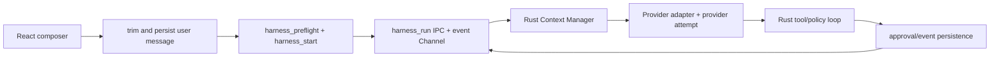
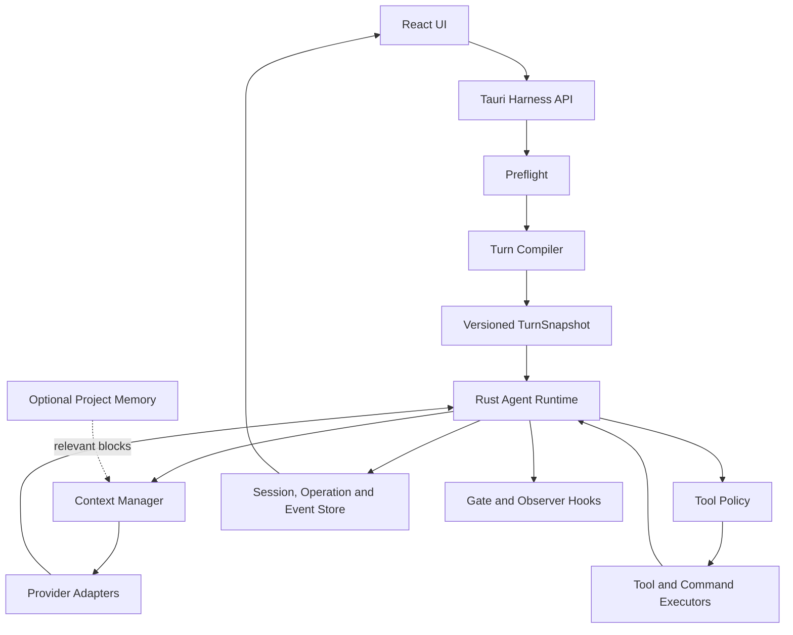
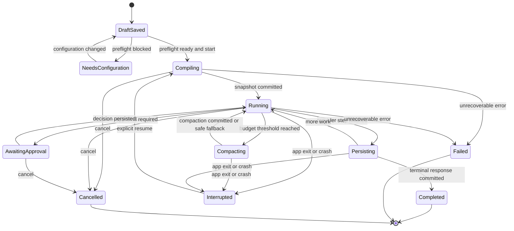

# LevelUpAgent Harness 设计文档

## 文档状态

| 项目 | 内容 |
| --- | --- |
| 状态 | Harness runtime、持久化恢复和事件驱动桌面链路已落地 |
| 更新日期 | 2026-07-26 |
| 适用分支 | `feature/harness` |
| 当前应用版本 | `1.0.14` |
| 目标版本 | 1.x 后续迭代 |
| 关联基线 | [`PROMPT_PIPELINE_BASELINE.md`](./PROMPT_PIPELINE_BASELINE.md) |

本文定义 LevelUpAgent 下一代 agent harness 的权威设计。Harness 统一管理草稿预检、任务编译、上下文选择、Provider 调用、工具策略、审批、恢复、会话持久化和运行观测。

本文讨论运行时契约，不讨论用户提示词的文案润色。实现必须保留用户原文，并让派生内容、权限决策、Provider 请求和工具副作用可追溯、可测试、可恢复。

当前工作树已完成 Harness 的核心迁移：所有桌面会话（包括宠物聊天、主题生成和残影孵化）均由 Rust `harness_run` 独占 agent loop，React 通过事件 Channel 做状态投影；审批、Provider attempt、context manifest、队列、session node、工具账本和恢复状态均写入 SQLite。历史消息仍保留，但旧的桌面兼容运行链路不再使用；恢复历史会创建新的正式 Harness operation。

## 1. 结论摘要

LevelUpAgent 当前已经具备四种 Provider 协议、工具循环、Skills、MCP、Goal、附件和 Provider failover，但 agent orchestration 分布在 React 递归流程与 Rust command 之间。下一代 harness 采用以下确定方案：

1. **Rust 拥有唯一运行循环**：React 只提交意图、展示事件和收集审批，不再决定最终权限或递归执行 agent turn。
2. **发送前先预检**：Provider、模型、凭据、工作区、权限和能力不满足时，不创建 Provider 请求；草稿原文保留并可继续发送。
3. **快照不可变且可版本化**：一个 operation 可以在 save point 产生多个 `TurnSnapshot`，每次 Provider 调用固定引用其中一个版本。
4. **权限在 Rust 最终裁决**：沿用现有 `request / agent / full` 名称，缺省值从 `full` 改为 `request`；任何级别都不能绕过路径、凭据和 schema 安全边界。
5. **上下文按 Token 预算治理**：system、instructions、tools、messages、attachments 和 memory 全部计入；当前用户输入不能被静默截断。
6. **副作用执行采用持久化账本**：审批、调用参数 hash、执行状态和结果先后可复盘；崩溃后结果不明的副作用工具不得自动重放。
7. **Memory 最后实现且默认关闭**：先完成安全、恢复、进程控制和上下文边界，再引入长期记忆或第二次 LLM 编译。

## 2. 目标与非目标

### 2.1 必须达到

- 原始草稿和最终用户消息保持完整；规范化文本、任务合同和摘要均为派生数据。
- 同一 thread 同时最多有一个 active operation，跨重启仍能执行此约束。
- 四种 Provider 协议共享 provider-neutral 的 snapshot 和 context manifest。
- 工具批准、拒绝、执行、错误、取消、超时、截断和结果不明均为结构化状态。
- `AwaitingApproval` 可在重启后恢复；已完成或结果不明的副作用不会自动重放。
- 每次 Provider 调用前重新验证能力和 Token 预算，工具调用与结果始终成组。
- Provider failover、凭据库、工作区路径限制、Goal 审计和子 Agent patch 二次批准不回归。
- 诊断信息足以重放控制流，但默认不保存密钥、完整工具参数、图片或外部响应正文。
- 写作空间继续使用独立的无工具补全链路，只复用 Token 估算和脱敏观测能力。

### 2.2 明确不做

- 首期不强制调用第二个模型重写用户输入。
- 不覆盖或回写 SQLite 中已有消息正文。
- 不允许前端、模型、Skill、MCP 或 hook 扩大权限。
- 不把全部工具、Skill 正文、MCP schema 和历史附件无条件送给模型。
- 不承诺 OS 级 shell sandbox；命令仍以当前操作系统账户运行。
- 不在首期实现跨项目记忆、公开 SDK、远程工作区或移动端专用交互。
- 不把 tool output、附件、网页或 memory 当作高优先级指令。

## 3. 当前基线与缺口

### 3.1 当前链路



当前实现事实：

- [`src/App.tsx`](../src/App.tsx) 中的桌面 `send()` 先调用 Harness 预检和启动，再由 `harnessRun()` 订阅 Rust 事件；旧的 React 递归 loop 仅作为无 Rust runtime 的浏览器预览实现。
- [`src/lib/storage.ts`](../src/lib/storage.ts) 的新用户权限缺省回退为 `request`；Rust `execute_tool` 会再次按 mode/permission 做最终裁决。
- [`src-tauri/src/agent.rs`](../src-tauri/src/agent.rs) 在协议适配前调用共享 Context Manager 按 Token 预算筛选原子消息单元，再使用 240,000 字符、160 条消息及单字段上限做 UTF-8 安全裁剪，并保护 tool call/result 配对。
- [`src-tauri/src/lib.rs`](../src-tauri/src/lib.rs) 负责请求入口、failover、工具 command 和凭据读取；`execute_tool` 已接收 mode、permission、operation/call ID，并在 Rust 侧执行最终策略裁决；协议适配实现在 `agent.rs`。
- [`src-tauri/src/database.rs`](../src-tauri/src/database.rs) 继续持久化 thread、message、Goal、Provider 和工具相关配置；Harness schema 同时保存 draft、operation、snapshot、event、context manifest、provider attempt、approval、queue、session node 和 tool execution 账本。

### 3.2 主要缺口

| 优先级 | 缺口 | 直接风险 |
| --- | --- | --- |
| P0 | 所有桌面会话的 Rust runtime、事件投影和审批恢复 | 已完成；历史会话恢复时重建 Harness operation |
| P0 | approval/event 投影和结果不明对账 | 已完成；token 一次性消费，unknown 提供人工界面 |
| P1 | Provider/auth/model 预检仍需覆盖更多 capability/预算边界 | 复杂发送失败路径与草稿生命周期仍需继续解耦 |
| P1 | agent loop 位于 React 递归 | 所有桌面会话已迁移到 Rust；React 递归只用于浏览器预览 |
| P1 | 上下文主要按字符预算 | Harness Context Manager 已先按 Token 预算筛选原子单元，再沿用 UTF-8 安全裁剪 |
| P1 | 工具结果缺少统一信任与错误 envelope | 注入边界和模型恢复行为不稳定 |
| P1 | 无 project instruction 分层和来源记录 | 指令冲突不可解释 |
| P2 | branch、steer 和 follow-up 仅需增强可视化入口 | 持久化 queue/session node API 已完成，运行中输入已可排队 |
| P3 | 缺少可撤销项目记忆 | 重复上下文成本较高，但不是安全前置条件 |

## 4. 术语与不变量

### 4.1 核心术语

| 术语 | 定义 |
| --- | --- |
| Draft | 尚未提交给 Provider 的用户原文、附件引用和显式 UI 选择 |
| Operation | 一次用户提交从预检通过到完成、失败或取消的持久化执行实例 |
| `TurnSnapshot` | 某个 save point 后生成的不可变运行配置版本；一个 operation 可引用多个版本 |
| Provider attempt | 使用一个 snapshot 和一个 context manifest 发起的一次 Provider 请求；failover 会产生新 attempt |
| Save point | assistant 响应及其工具批次达到一致持久化边界的位置 |
| Session node | thread 中带 parent/branch 关系的 user、assistant、tool 或 summary 节点 |
| Context block | 带来源、信任、hash、Token 估算和 inclusion 决策的模型输入单元 |

### 4.2 强制不变量

1. `raw_user_input` 只读保存；空白判断使用派生值，不得用 `trim()` 结果覆盖原文。
2. operation 的状态转换、事件 sequence 和 `current_snapshot_id` 在同一数据库事务内提交。
3. 每个 Provider attempt 固定引用一个 `snapshot_id` 和一个 `context_manifest_id`。
4. `(operation_id, tool_call_id)` 唯一；相同调用不得创建第二条副作用执行记录。
5. 工具必须经过 `schema -> capability -> workspace -> permission -> approval` 全部 gate 才能执行。
6. assistant tool call 与全部匹配 tool result 是不可拆分上下文组；缺失、重复或孤立结果不发送给 Provider。
7. Provider 已产生首个可见 delta 或 tool call 后，不再 failover 到另一个 Provider。
8. `Running` 中断后只恢复到最后已提交 save point；状态为 `unknown` 的副作用必须人工处理。
9. UI 事件是持久化状态的投影，不是状态唯一来源；重复或乱序事件不得改变权威状态。
10. Memory、hook、TaskContract 和 tool output 均不能扩大 `ExecutionPolicy`。

## 5. 总体架构



建议新增模块：

```text
src-tauri/src/harness/
  mod.rs
  types.rs          # request、snapshot、state、event、error
  preflight.rs      # workspace/provider/auth/capability readiness
  compiler.rs       # draft、指令、附件、Goal、工具编译
  instructions.rs   # 指令发现、优先级、来源和冲突
  runtime.rs        # 唯一 agent loop、save point、恢复和取消
  context.rs        # Token 账本、选择、裁剪和压缩
  policy.rs         # 模式、权限、风险、gate 和 approval
  tools.rs          # schema 选择、执行 envelope、结果策略
  command.rs        # 跨平台进程树、流式输出、超时和取消
  events.rs         # 版本化事件与 UI 脱敏投影
  persistence.rs    # operation、snapshot、事件和执行账本
  hooks.rs          # 有界 gate/observer 扩展
  memory.rs         # 后续可选项目记忆
```

现有 `agent.rs` 保留协议序列化、SSE 解析和响应归一化；`tools.rs`、`mcp.rs`、`skill.rs`、`attachment.rs`、`subagent.rs` 和 `database.rs` 作为能力实现被 harness 调用。Provider adapter 不感知 UI、审批或权限策略。

## 6. 生命周期与并发

### 6.1 状态机



`NeedsConfiguration` 属于 draft/preflight 状态，不代表 Provider operation 已启动。审批拒绝产生结构化 `denied` tool result，模型可继续解释或改选方案；只有明确取消才进入 `Cancelled`。

### 6.2 单次运行顺序

1. 原子保存 Draft；保留原始 UTF-8 文本和附件 ID。
2. 预检 workspace、thread、profile、credential、model、capability、permission 和 active-operation lock。
3. 预检通过后，在数据库事务外编译 snapshot candidate；读取的配置、指令和能力都带 version/hash。
4. 使用短事务重新验证 active-operation lock 和 version/hash，再原子提升 Draft、创建 user message/operation 并提交首个 snapshot。
5. Context Manager 生成 context manifest，`before_provider` gate 验证全部不变量。
6. Provider adapter 流式返回 assistant delta 或 tool call；每个 attempt 单独记录。
7. 工具调用先落 `proposed` 记录，再经过 Rust policy；需要批准时进入 `AwaitingApproval`。
8. 工具结果结构化持久化后才允许进入下一次 Provider 上下文。
9. save point 原子提交消息节点、工具结果、队列消费位置、usage 和新 snapshot 版本。
10. runtime 决定继续、压缩、等待批准、完成、失败或取消。

### 6.3 并发、取消与恢复

- 使用 SQLite 部分唯一索引和进程内 lock 双重保证同一 thread 只有一个 active operation。
- 只允许显式声明为只读、无副作用且可并行的工具并发；有副作用工具默认按 provider call 顺序串行执行。
- `cancel` 先持久化取消意图，再触发 cancellation token；未开始工具保持 `cancelled`，已完成结果照常提交。
- `CommandRunner` 在 Windows 使用 Job Object，在 Unix 使用 process group，取消和超时必须终止整个子进程树。
- 崩溃时处于 `running` 的只读工具可以重试；副作用工具改为 `unknown`，不得自动重放。
- `AwaitingApproval` 重启后原样恢复；approval token 必须绑定 operation、snapshot、call ID 和参数 hash，并且只能消费一次。

## 7. 预检与 Turn Compiler

### 7.1 请求与报告

```rust
pub struct HarnessDraftRequest {
    pub thread_id: String,
    pub raw_user_input: String,
    pub attachment_ids: Vec<String>,
    pub mode: AgentMode,
    pub permission_level: PermissionLevel,
    pub requested_profile_id: Option<String>,
}

pub struct PreflightReport {
    pub draft_id: String,
    pub ready: bool,
    pub provider: ProviderReadiness,
    pub workspace: WorkspaceReadiness,
    pub capabilities: ProviderCapabilities,
    pub diagnostics: Vec<Diagnostic>,
}
```

前端传入值仅表达用户选择。Rust 必须从 SQLite、系统凭据库和 canonical workspace 重新解析权威配置。`draft_id` 只是本地引用，不包含正文或凭据。

预检至少检查：

- thread 存在且没有 active operation；
- workspace 可用，临时 workspace 已创建且 canonical path 合法；
- Provider profile 已保存、Base URL 合法、凭据存在或明确允许无认证；
- model 和协议能力可解析；未知能力使用保守最小值并给出 warning；
- mode 与 permission 合法，缺省或无效 permission 解析为 `request`；
- 附件 ID、数量、类型和大小满足现有约束；
- 原始用户输入或附件至少有一项，且输入可在最小上下文预算中完整容纳。

### 7.2 Snapshot

```rust
pub struct TurnSnapshot {
    pub id: String,
    pub operation_id: String,
    pub version: u32,
    pub raw_user_message_id: String,
    pub task_contract: TaskContract,
    pub instruction_layers: Vec<InstructionLayer>,
    pub execution_policy: ExecutionPolicy,
    pub trust_manifest: TrustManifest,
    pub selected_tools: Vec<SelectedTool>,
    pub provider: ProviderSnapshot,
    pub parent_snapshot_id: Option<String>,
    pub created_at: i64,
}
```

snapshot 内容序列化后计算 hash。save point 只能新建下一版本，不能修改旧版本。operation 表只保存 `current_snapshot_id`；Provider attempt 保存实际使用的 snapshot ID。

### 7.3 编译规则

1. `raw_user_input` 原样保存。编译器可派生换行统一、空白判断和长度统计，但不得回写原文。
2. `TaskContract` 首期只提取宿主能确定的字段；不确定字段保持空并记录来源，不能伪造用户意图。
3. workspace、goal、instructions、skills、tools、MCP 和 Provider 均在 Rust 中重新读取。
4. 工具先按 mode、capability 和风险分类过滤，再按任务相关性确定性排序；被排除项和原因进入 manifest。
5. 附件由 `attachment::resolve` 校验和提取，以不可信 context block 进入预算。
6. 编译结果包含来源 ID、content hash 和 policy version，支持测试与复盘。

### 7.4 指令优先级

从高到低固定为：

1. 产品安全规则和协议不变量。
2. Rust 生成的 execution policy、mode 和 capability 约束。
3. 当前用户明确请求。
4. SQLite 全局用户 Instructions。
5. 工作区项目指令；更靠近当前工作目录的文件覆盖工作区根目录同类规则。
6. 用户明确选择或宿主确定匹配的 Skill 工作流。
7. Goal 状态、TaskContract 和运行诊断；它们是派生约束，不能覆盖原始用户请求。

项目指令只在 canonical workspace 内发现：从 workspace 根到目标工作目录逐级读取 `AGENTS.md`，首期可兼容 `CLAUDE.md`、`GEMINI.md` 和 LevelUpAgent 专用文件。自动引用不得越过 workspace 根；符号链接、绝对路径和 `..` 引用一律拒绝并记录诊断。

### 7.5 信任边界

| 来源 | 角色 | 是否可改变权限 |
| --- | --- | --- |
| `product_rule` | 宿主安全指令 | 仅产品代码可定义 |
| `execution_policy` | Rust 运行契约 | 仅 Rust policy 可定义 |
| `user_input` | 用户意图 | 否，需经 policy 执行 |
| `project_instruction` | 工作区指令候选 | 否 |
| `skill_instruction` | 已选择 Skill 工作流 | 否 |
| `managed_attachment` | 不可信数据 | 否 |
| `tool_output` / `mcp_output` | 不可信数据 | 否 |
| `memory` | 可撤销历史事实 | 否 |

附件、文件、命令、网页、MCP 和 memory 中形似系统指令的文本只能作为数据引用，不能改变 system rules、tool schema 或 approval policy。

## 8. Context Manager

### 8.1 Token 账本

```rust
pub struct ContextBudget {
    pub context_window: u32,
    pub reserve_output_tokens: u32,
    pub safety_margin_tokens: u32,
    pub system_tokens: u32,
    pub instruction_tokens: u32,
    pub tool_schema_tokens: u32,
    pub message_tokens: u32,
    pub attachment_tokens: u32,
    pub memory_tokens: u32,
}
```

输入容量计算为：

```text
input_capacity = context_window - reserve_output_tokens - safety_margin_tokens

system + instructions + tool_schemas + messages + attachments + memory
  <= input_capacity
```

能力来源优先级为：经过测试的本地 capability catalog、Provider 明确元数据、历史 usage 校准、保守默认值。估算器必须可替换并记录版本；Provider 返回 usage 只用于校准后续估算，不能证明本次请求之前的精确值。

### 8.2 选择与降级规则

从高到低选择：

1. 当前用户消息全文。
2. 当前 Goal、execution policy 和必要项目指令。
3. 未完成的 assistant tool call 与全部匹配结果。
4. 当前附件的必要内容或明确摘录。
5. 最近的 user/assistant 对话。
6. 已提交的相关摘要。
7. 低相关历史工具输出和可选 memory。

当前用户消息若无法完整放入最小合法请求，返回 `context_input_too_large`，不得静默删除中间内容后继续发送。附件允许按文件生成摘录或 artifact 引用，但 UI 必须显示 inclusion 和 truncation 结果。所有省略、裁剪和压缩只作用于请求副本，不修改原始消息或 artifact。

tool call/result 组必须整体选择。若协议历史中发现孤立、重复或缺少结果的组，应在 Provider 请求前 fail closed，并产生可定位诊断，而不是尝试猜测修复。

### 8.3 压缩

- 使用率达到输入容量的 80% 时后台准备压缩候选；达到 85% 时，下一次 Provider 调用前必须压缩或确定性裁剪。
- 首期使用确定性的结构化压缩：保留目标、决策、文件变更、错误、未完成动作和来源范围；LLM 摘要作为后续可选策略。
- 压缩目标低于 65%，形成迟滞，避免每轮重复压缩。
- summary 作为独立 session node 保存，记录 `source_node_ids`、前后 Token、算法版本和 hash。
- 压缩失败不删除历史，回退到最近性选择和工具组安全裁剪；仍无法满足预算时返回结构化错误。
- 工具循环每次 Provider 调用前检查预算，不只在用户 turn 边界检查。

### 8.4 Context manifest

每个 context block 至少记录：

```text
block_id, source_kind, source_id, content_hash, trust_level
estimated_tokens, estimator_version, inclusion, omission_reason
truncated, summary_id, ordinal
```

manifest 另外记录 Provider/model、capability 来源、预算各项、已选/排除工具及原因。默认诊断只展示统计、hash 和短脱敏摘录，不展示密钥、完整图片、完整参数或敏感正文。

## 9. Tool Policy 与执行账本

### 9.1 模式和权限

现有 mode 保持不变：

| Mode | 模型可见工具 |
| --- | --- |
| `chat` | 无工具 |
| `plan` | 只读工具；permission 不能扩大该边界 |
| `agent` | 根据 capability、任务选择和 permission 暴露工具 |
| `goal` | `agent` 工具加 Goal 工具；完成/阻塞仍需宿主证据审计 |

权限语义统一为：

| Permission | 自动允许 | 必须批准 |
| --- | --- | --- |
| `request` | 只读、无外部副作用工具 | 写入、删除、命令、MCP、媒体、委派、patch 等其余调用 |
| `agent` | 只读、受限 `edit_file`/`write_file`、隔离 worktree 中的 `delegate_task` | 删除、shell、外部服务、付费媒体、patch 和未列入 allowlist 的调用 |
| `full` | 通过硬安全 gate 后的已暴露工具 | 仅产品定义的不可自动批准动作 |

`full` 仍不能绕过 canonical workspace、schema、大小/超时限制、凭据隔离、Provider capability、Goal 审计或 subagent patch 完整性检查。新安装、缺失值和非法值均使用 `request`；升级后已有 `full` 需要一次显式重新确认。

### 9.2 生命周期

```text
discover -> select -> expose -> schema validate -> capability gate
  -> workspace gate -> permission gate -> approval if required
  -> record intent -> execute -> sanitize -> persist -> context policy
```

工具风险分类至少包含：`read_only`、`workspace_write`、`destructive`、`process`、`external`、`costly`、`delegation` 和 `credential_sensitive`。风险由宿主注册表定义，模型和 MCP 描述不能覆盖。

approval 首期按单个 tool call 处理，不做模糊的批量同意。批准界面显示工具、目标、参数脱敏摘要、风险、工作区和有效期；approval token 与参数 hash 绑定，参数变化后必须重新批准。

### 9.3 Tool result envelope

```rust
pub struct ToolResultEnvelope {
    pub call_id: String,
    pub tool_name: String,
    pub status: ToolExecutionStatus,
    pub is_error: bool,
    pub truncated: bool,
    pub source: ToolResultSource,
    pub trust: TrustLevel,
    pub context_inclusion: ContextInclusion,
    pub content: Vec<ContentBlock>,
    pub artifact_ref: Option<String>,
    pub stdout_ref: Option<String>,
    pub stderr_ref: Option<String>,
    pub exit_code: Option<i32>,
}
```

`ToolExecutionStatus` 至少支持 `proposed / awaiting_approval / denied / running / succeeded / failed / cancelled / unknown`。`ContextInclusion` 支持 `include / exclude / summary_only`；UI 可见不等于必须进入模型上下文。

大输出写入受限 artifact，模型只接收引用、状态和有界摘要。stdout/stderr 分开保存和脱敏。工具返回的文本永远不能改变系统规则、权限或工具 schema。

### 9.4 副作用恢复

执行前持久化 `running` 状态与输入 hash，执行后持久化结果。若进程在两次提交之间崩溃：

- 只读调用可根据同一 call ID 重试并覆盖为明确结果；
- 有幂等键且执行器能向目标系统查询结果的调用，先对账再决定是否继续；
- 其他副作用调用标记为 `unknown`，展示已知参数、时间和本地证据，要求用户选择“视为完成”“确认未执行后重试”或“取消 operation”；
- runtime 不宣称通用 exactly-once，目标是 at-most-once 自动执行加显式对账。

## 10. Provider、能力与 failover

四种协议继续由现有 adapters 负责：OpenAI Responses、OpenAI Chat Completions、Anthropic Messages 和 Gemini GenerateContent。它们接收相同的 snapshot、context blocks 和 tool definitions，只在 wire format 层转换。

`ProviderCapabilities` 至少包含：

```text
context_window, max_output_tokens, streaming, tool_calls,
parallel_tool_calls, vision, reasoning, usage_reporting
```

未知 capability 使用保守默认值：不假定工具、多模态、并行调用或长上下文可用。Provider attempt 记录 profile、protocol、model、snapshot、manifest、开始/结束时间、首个 delta 时间、usage、request ID、错误类别和 failover 来源，但不记录密钥或完整 payload。

只有在以下条件全部满足时才可 failover：

1. 当前 attempt 尚未产生 assistant delta 或 tool call；
2. 尚未执行由该 attempt 提议的工具；
3. 错误属于连接、超时、429 或 5xx 等可重试类别；
4. 目标 Provider capability 能承载同一个逻辑请求；
5. 新 attempt 重新序列化并重新检查预算，而不是复用旧 wire payload。

## 11. 持久化、会话树与队列

### 11.1 新增存储

采用附加表，不一次性重写现有 `threads` 和 `messages`：

| 表 | 作用 | 关键约束 |
| --- | --- | --- |
| `harness_drafts` | 保存未发送原文和附件引用 | draft ID 不含正文；promotion 只能一次 |
| `harness_operations` | operation 状态和当前 snapshot | active thread 部分唯一索引 |
| `harness_snapshots` | 不可变版本化 snapshot | `UNIQUE(operation_id, version)` |
| `harness_events` | 可重放控制流事件 | `UNIQUE(operation_id, sequence)` |
| `harness_context_manifests` | 每次请求的上下文决策 | 关联 snapshot 和 attempt |
| `harness_provider_attempts` | Provider 请求和 failover 元数据 | 不保存 secret/full payload |
| `harness_tool_executions` | 工具意图、状态、hash 和结果引用 | `UNIQUE(operation_id, call_id)` |
| `harness_approvals` | 一次性批准或拒绝 | token hash 唯一且消费一次 |
| `harness_compactions` | summary 来源、算法和 Token 变化 | summary 正文保存为 session node |
| `harness_session_nodes` | parent/branch 关系 | parent 同属 thread |
| `harness_session_heads` | thread 当前 active leaf | 每个 thread 一个 head |
| `harness_queues` | steer/follow-up/next-turn | 只能按状态单向转换 |

所有表使用 foreign key 和 `ON DELETE CASCADE` 跟随 thread/operation 生命周期，时间使用 UTC epoch，JSON 字段包含 `schema_version`。数据库迁移保持 additive；旧消息按 position 映射为单一 root-to-leaf 分支，不改写原消息。

### 11.2 事件与事务

- 状态变化与对应事件在同一事务写入，sequence 单调递增。
- save point 原子提交 assistant/tool/session node、usage、队列 cursor 和下一 snapshot。
- 前端以 `(operation_id, sequence)` 去重，并能从任意 last sequence 重放。
- event payload 只保存脱敏状态、hash 和引用；消息正文继续由 message/session 存储负责。
- 启动时扫描非终态 operation：恢复审批，其他运行态标记 `Interrupted`，不得静默继续副作用。

### 11.3 Session tree 和运行中输入

- `steer(text)`：持久化到当前 operation，不创建新 root。用户点击“立即引导”时，如果当前处于 Provider 输出阶段，只取消当前 Provider turn，不取消 operation；runtime 随后在同一个 operation 中消费该队列项并继续下一轮。如果当前处于工具执行阶段，不取消工具，待工具结果提交后再注入引导消息。
- `follow_up(text)`：当前 operation 结束后，以 active leaf 创建新的 user node 和 operation。
- `next_turn(text)`：请求当前 operation 在下一 save point 结束，再按 follow-up 语义启动。
- `retract(queue_id)`：仅能撤回尚未注入 Provider 的消息，必须产生事件。
- `cancel()`：取消当前执行；队列默认保留，UI 明确询问是否继续或清空。
- fork/clone 从指定 node 产生新 branch；Context Manager 只沿 active leaf 的祖先链选择历史，禁止分支串线。

## 12. Tauri API 与事件契约

### 12.1 Commands

```text
harness_preflight(request) -> PreflightReport
harness_start(request) -> OperationStarted
harness_check_tool(request) -> PolicyDecision
harness_resolve_approval(operation_id, approval_id, decision) -> OperationState
harness_cancel(operation_id) -> OperationState
harness_resume(operation_id) -> OperationState
harness_steer(operation_id, queue_id) -> Result<(), Error>
harness_follow_up(operation_id, text) -> QueueItem
harness_next_turn(operation_id, text) -> QueueItem
harness_retract(queue_id) -> QueueItem
harness_get_operation(operation_id) -> OperationView
harness_get_events(operation_id, after_sequence) -> Vec<HarnessEvent>
harness_get_context(operation_id, attempt_id) -> ContextDiagnostics
harness_get_tree(thread_id) -> SessionTree
```

旧 `agent_turn`、`agent_turn_stream` 和 `execute_tool` 在迁移期保留内部能力函数，但新 UI 不再用它们维护 agent loop。新 runtime 稳定后应从 Tauri invoke handler 移除这些公开 command；迁移期 legacy feature 发起的调用也必须创建受管 operation，并以 `request` 作为缺省权限进入同一 Rust policy，不能形成旁路。

### 12.2 Events

事件 envelope 包含 `schema_version`、`operation_id`、`thread_id`、`snapshot_id`、`sequence`、`kind` 和时间戳。首期事件：

```text
preflight_blocked, operation_started, snapshot_created, context_prepared,
provider_attempt_started, assistant_delta, assistant_completed,
provider_turn_interrupted, queue_injected,
tool_call_proposed, tool_approval_required, tool_execution_started,
tool_execution_updated, tool_execution_completed, steering_queued,
compaction_started, compaction_completed, provider_failover,
save_point_committed, operation_interrupted, operation_resumed,
operation_completed, operation_failed, operation_cancelled
```

事件 schema 在公开 CLI/RPC/SDK 前冻结并版本化。前端未知事件必须安全忽略；未知 schema major version 必须拒绝并提示升级。

### 12.3 桌面 UI 契约

- 发送失败于预检时保留 draft、附件和光标上下文，并打开可恢复的连接设置。
- Context Diagnostics 显示 model、窗口、已用/保留 tokens、工具 schema、附件、compaction、排除原因、branch/leaf 和 permission。
- 审批界面展示参数 hash 对应的实际目标与风险，拒绝和取消是不同操作。
- 运行中发送区提供 `steer / follow-up / stop` 明确选择，队列显示在输入框上方。“立即引导”只影响当前 Provider turn；工具执行期间会等待工具完成，不会终止整个 operation。
- 图标按钮有稳定 accessible name；连接弹窗内部滚动，footer 不遮挡表单；键盘焦点、Escape 和屏幕阅读顺序纳入 E2E。

## 13. Hooks 与可选 Memory

Hook 分为会改变是否继续的 gate 和不改变流程的 observer：

| Hook | 类型 | 约束 |
| --- | --- | --- |
| `before_compile` | gate | 可拒绝，不可修改原文或扩大权限 |
| `before_provider` | gate | 验证 snapshot、capability 和预算 |
| `before_tool` | gate | 可拒绝或提升审批要求，不可降低风险 |
| `after_tool` | transform/observer | 仅可脱敏、截断或降低 inclusion |
| `save_point` | observer | 失败不回滚已提交状态 |
| `after_operation` | observer | 诊断、通知或排队 memory 候选 |

所有 hook 有超时、取消、递归深度和输入大小限制；默认不能读取凭据。gate 失败 fail closed，observer 失败仅记录诊断。

Memory 在核心批次完成后实现，默认关闭且按项目启用。每条 memory 保存来源节点、operation、trust、创建/验证/过期时间和撤销状态；禁止跨项目检索，也不保存 API Key、环境变量、完整命令输出、附件二进制或未脱敏个人数据。每轮注入数量和 Token 有硬上限，无相关结果时注入 0 条。

## 14. 安全与隐私

- Rust 是 workspace、Provider、credential、Goal、capability、permission 和 tool registry 的权威来源。
- 所有路径继续使用相对路径校验、canonical path 和符号链接边界；项目指令发现也使用同一约束。
- API Key 只从系统凭据库读取，不进入 snapshot、event、manifest、approval 或 prompt preview。
- Prompt preview 默认只展示类别、长度、hash、来源和短脱敏摘录；显式查看正文也不能显示 secret 字段。
- MCP、Skill、附件、tool output、memory 和 Provider 响应均视为不可信输入。
- Tool schema 只能来自宿主注册表或经过上限与风险映射的 MCP discovery，不能由模型动态注册。
- 子 Agent 继续使用隔离 worktree；patch 应用前复核仓库根、HEAD、worktree 状态和 diff，并再次批准。
- CommandRunner 不宣称 OS sandbox；审批 UI 必须说明 shell 和 stdio MCP 拥有当前用户权限。
- 日志和诊断保留期限可配置；删除 thread 时级联删除 operation、event、manifest、artifact 引用和 memory 关联。

## 15. 可观测性与错误模型

### 15.1 结构化错误

错误至少分为：

```text
preflight, validation, permission_denied, approval_expired,
context_overflow, provider_retryable, provider_terminal,
tool_failed, tool_unknown, cancelled, persistence, invariant_violation
```

Provider 400/422、schema 错误、工作区越界、凭据缺失和不变量破坏不可自动重试。连接、超时、429 和无输出的 5xx 可按 failover 规则重试。工具失败以结构化结果回灌，不能伪装成成功。

### 15.2 指标

安全和正确性指标：

```text
preflight_false_start_rate = 0
draft_loss_rate = 0
permission_bypass_rate = 0
side_effect_auto_replay_rate = 0
context_protocol_violation_rate = 0
session_parent_integrity = 100%
tool_output_policy_accuracy = 100%
desktop_accessible_name_coverage = 100%
```

质量和性能指标：

```text
context_overflow_rate
selected_tool_precision
unnecessary_tool_call_rate
resume_after_restart_rate
queue_loss_rate
compaction_token_reduction
time_to_first_delta
save_point_commit_latency
provider_failover_success_rate
export_round_trip_rate
```

所有报告分开记录 pass、fail、skip；skip 必须标注 credential、network、platform 或 missing-tool 原因，不能用“无真实模型”掩盖确定性 harness 失败。

## 16. 实施与迁移路线

### Batch 0：安全与预检

- 权限缺省值改为 `request`，已有 `full` 要求一次重新确认。
- 实现 draft store、`PreflightReport` 和 Provider/model/auth/workspace readiness。
- Rust policy 覆盖写入、删除、命令、MCP、媒体、委派和 patch；旧 command 不能旁路。
- 修复连接弹窗草稿恢复、键盘焦点和 desktop accessible name。

退出条件：无凭据发送不调用 Provider且不丢输入；直接 IPC 不能绕过 Rust gate。

### Batch 1：持久化 Runtime

- 新增 operation、snapshot、event、attempt、approval 和 tool execution 表。
- 实现单一 Rust loop、operation lock、save point、事件重放和 cancellation token。
- React 改为消费事件；浏览器预览才保留明确命名的本地 loop，桌面路径没有兼容 fallback。
- 恢复 `AwaitingApproval`，将其他未提交运行态标记为 `Interrupted`。

退出条件：崩溃、重复事件、重复审批和 failover 边界测试通过；副作用不自动重放。

### Batch 2：执行边界与会话控制

- 实现跨平台 `CommandRunner`、进程树取消和 stdout/stderr 流式 artifact。
- 引入 tool result inclusion、steer/follow-up/next-turn/retract 队列。
- 增加 session node/head，支持 tree/fork/clone，旧 thread 映射为单分支。

退出条件：取消不遗留子进程；排除输出在 UI 可见但不进入 Provider；分支上下文不串线。

### Batch 3：Context Manager

- 引入 capability catalog、Token estimator、context manifest 和工具目录筛选。
- 实现 80% 预备、85% 强制、65% 目标的确定性压缩策略。
- 增加 Context Diagnostics 和 prompt composition preview。

退出条件：四协议 fixtures 不超出配置预算，当前输入不被静默截断，tool call/result 配对完整。

### Batch 4：互操作与可观测性

- 冻结事件 schema 和 redaction 规则。
- 持久化 session 支持 JSONL/HTML 导入导出；内存态返回 `persist_first_required`。
- 建立完整指标、故障注入和长会话评测集。

### Batch 5：Hooks 与 Memory

- 先开放有界 observer/gate，再实现 SQLite/FTS 项目记忆。
- embedding 和 LLM relevance judge 单独评估，保持默认关闭。

迁移全程使用 feature flag。允许旧 UI 与新表并存，但禁止同一个 operation 同时由旧 loop 和新 runtime 执行。回滚只切回旧读取路径，不删除新表或改写旧 messages。

## 17. 验证方案

验证分为六层。每个 Batch 只有在本层适用门禁全部通过后才能进入下一批；真实 Provider 测试不能替代确定性测试。

### 17.1 文档与静态契约

| 检查 | 方法 | 通过标准 |
| --- | --- | --- |
| Markdown 结构 | 检查标题层级、代码围栏、表格和尾随空白 | 无断层、未闭合围栏或格式错误 |
| 本地链接 | 验证所有 `./`、`../` 链接目标 | 目标全部存在 |
| Mermaid | 渲染 flowchart 和 state diagram | 无语法错误，状态与正文一致 |
| 名称一致性 | 搜索旧的 `ask/auto/always-approve` 和重复 API | 仅使用本文定义的 mode、permission、command 和 event |
| 代码事实 | 对照 `App.tsx`、`storage.ts`、`agent.rs`、`lib.rs`、`database.rs` | 基线描述可在当前分支定位 |

### 17.2 Rust 单元测试

- `preflight`：缺 profile、缺 credential、未知 model、临时 workspace、active-operation 冲突、超大输入和 draft 保留。
- `compiler`：原文 hash、指令优先级、工作区层级、越界引用、TaskContract provenance、确定性工具选择。
- `state machine`：所有合法/非法转换，terminal state 不可回退，approve/cancel/resume 幂等。
- `policy`：四 mode × 三 permission × 所有风险类的表驱动测试；前端伪造 permission 不生效。
- `context`：预算计算、当前输入完整性、工具组原子性、附件摘录、阈值迟滞、确定性压缩和 estimator 版本。
- `persistence`：sequence 单调、active thread 唯一、snapshot 不可变、call ID 唯一、级联删除和 migration rollback compatibility。
- `redaction`：API Key、Authorization、MCP secret、图片、完整参数和敏感正文不进入事件或 preview。

### 17.3 Provider 契约与集成测试

使用本地 faux server，覆盖 OpenAI Responses、OpenAI Chat、Anthropic 和 Gemini：

- 同一 snapshot 生成四种合法请求，system、tools、attachments 和 tool results 映射正确。
- 流式 delta、纯文本、纯 tool call、混合响应、usage 缺失和 malformed SSE。
- 429/5xx 在首个输出前 failover；首个 delta 后禁止 failover。
- 多轮工具循环每次重新生成 context manifest，错误/拒绝/取消/截断状态能被下一轮区分。
- 工具结果先持久化后再请求 Provider，事件重放得到相同控制流。
- 注入样本覆盖附件、文件、shell、MCP 和 memory 中的伪系统指令。

### 17.4 故障注入与恢复测试

在以下提交边界强制终止进程并重启：

| 故障点 | 预期结果 |
| --- | --- |
| draft 保存后、operation 创建前 | draft 可继续，无 Provider attempt |
| snapshot 提交后、请求前 | resume 使用同一或显式新 snapshot，不重复 user message |
| 首个 delta 后 | operation 为 `Interrupted`，不触发 failover |
| approval 创建后 | 重启恢复同一 approval，重复批准只消费一次 |
| tool intent 后、执行前 | 未执行工具可安全继续 |
| 副作用执行中 | 状态为 `unknown`，不自动重放 |
| tool result 后、save point 前 | 通过 execution ledger 对账，不重复副作用 |
| compaction 临时结果后 | 原历史保持完整，丢弃未提交 summary |
| save point 提交后 | resume 从下一步继续，队列 cursor 不回退 |

另外验证 Windows Job Object 与 Unix process group：超时、取消和应用退出后子进程数归零；`rg`、`fd` 等可选加速器不可用或崩溃时回退到内置 walker。

### 17.5 前端与真实 Tauri E2E

桌面 E2E 至少覆盖：

1. 无模型发送，草稿保留，配置完成后继续原 draft。
2. `request` 权限下完成一次批准和一次拒绝，UI 与 Rust 状态一致。
3. 运行中分别提交 steer、follow-up 和 stop，消息不丢失且语义不同；Provider 输出阶段 steer 应打断当前 turn 但让同一 operation 继续，工具执行阶段 steer 应等待工具完成后再注入。
4. 应用在待审批和工具完成后分别重启，恢复结果符合账本。
5. Context Diagnostics 的预算、排除项和当前 branch 与测试 fixture 一致。
6. fork 后两个分支互不引用对方消息，切换 active leaf 后可继续。
7. 连接弹窗可滚动，footer 不遮挡；仅键盘可完成配置、审批、恢复和取消。
8. 关键图标 accessible name 非空，屏幕阅读顺序与视觉顺序一致。

Windows 原生 Tauri 是进程树、凭据库和主要桌面生命周期的必测平台；Linux 至少覆盖 SQLite、符号链接、process group 和构建。macOS 在发布支持范围内执行同类冒烟，未执行项必须标为 platform skip。

### 17.6 回归、构建与真实 Provider 冒烟

每个涉及 host/runtime 的 PR 执行：

```bash
pnpm check
pnpm build
cargo fmt --manifest-path src-tauri/Cargo.toml -- --check
cargo clippy --manifest-path src-tauri/Cargo.toml --all-targets -- -D warnings
cargo test --manifest-path src-tauri/Cargo.toml
pnpm tauri build
```

协议或 Provider 改动另外执行：

```bash
pnpm verify:levelupapi
```

真实 Provider 冒烟使用专用测试账户和最小数据，四协议各验证一轮纯文本和一轮只读工具；随后验证一个无输出 failover。测试报告只保存 Provider、model、request ID、usage 和时延，不保存 prompt、附件、工具参数或 secret。

生产候选需要执行长会话 soak：至少 100 次 Provider step、混合工具结果、两次 compaction、一次 steer、一次 follow-up 和一次应用重启。退出后不得有活跃 operation、遗留子进程、未解释的 `unknown` 工具或 orphan context block。

### 17.7 Batch 1 最小人工验收

1. 使用已存在的 thread 发送一条带首尾空格的消息；Provider 请求使用 trim 后内容，但 `harness_drafts.raw_user_input` 必须保留原文。
2. 在无凭据或无效 workspace 时发送；界面显示 preflight 错误，draft 和附件仍保留，不创建 Provider 请求。
3. 在有效配置下发送；数据库出现一条 draft、一条 `compiling` operation、一个初始 snapshot 和一个 `operation_started` event，随后 operation 状态进入 `running`。
4. 触发需要审批的工具；operation 进入 `awaiting_approval`，批准后回到 `running`，拒绝不会执行副作用。
5. 正常完成、取消、Provider 错误和应用中断各执行一次；operation 最终分别记录 `completed`、`cancelled`、`failed` 或 `interrupted`，同一 operation ID 不随 React 递归轮次变化。
6. 对同一 thread 连续启动两个 operation；第二次必须被 active-operation 唯一约束阻止，首个 operation 进入终态后才允许再次启动。
7. 让一次带 operation/call ID 的只读工具完成；`harness_tool_executions` 必须出现唯一 `(operation_id, call_id)` 记录，状态从 `running` 变为 `succeeded`，结果只保存有界摘要。
8. 通过 `harness_check_tool` 验证 `chat/plan/request/agent/full` 矩阵；直接调用 `execute_tool` 也不能绕过 Rust 决策，该 command 只能返回决策，不能直接执行工具。

若仓库环境没有 `pnpm`，可先执行 `npm run build` 验证前端，再使用 Tauri CLI 临时覆盖 `beforeBuildCommand`；不要把本地工具链替代项写回发布配置。

## 18. 验收门禁

功能完成的最低标准：

1. 原始输入可从 draft/message 追溯，派生字段不能覆盖原文；超大输入明确阻止发送。
2. Rust policy 的 mode/permission 表驱动测试全通过，直接 IPC 无法绕过审批。
3. 同一 operation 的 snapshot、attempt、event、approval 和 tool result 可按 ID/sequence 复盘。
4. 四协议请求通过本地契约测试；预算、tool group 和 trust envelope 不变量全通过。
5. 重启不会自动重放已完成或结果不明的副作用；`unknown` 有明确人工对账路径。
6. `AwaitingApproval`、steer/follow-up queue 和 active leaf 跨重启不丢失。
7. Provider 首个输出后的故障不会触发 failover 或拼接不同模型响应。
8. prompt preview、event 和日志的 secret/redaction 测试全通过。
9. `pnpm check`、前端生产构建、Rust fmt/clippy/test、Tauri build 和 Windows 原生生命周期通过。
10. Memory、hooks 和增强 compaction 关闭时，基础 chat/plan/agent/goal 仍可用。

以下指标必须为零：`draft_loss_rate`、`permission_bypass_rate`、`side_effect_auto_replay_rate`、`context_protocol_violation_rate` 和 `windows_process_leak_rate`。任何一个非零都阻止发布，不能以 feature flag 外的已知问题豁免。

## 19. 已锁定决策与待评审项

### 19.1 已锁定

- operation/event/snapshot 使用新表关联现有 messages，避免破坏旧查询。
- permission 名称沿用 `request / agent / full`，缺省为 `request`。
- 首期 approval 按单调用，参数变化后重新批准。
- Token 先采用保守估算器加 Provider usage 校准，接口允许替换 tokenizer。
- 项目指令只在 workspace 内按根到当前目录发现，不读取 workspace 外引用。
- 首期 compaction 为确定性结构化压缩，LLM 摘要不是核心依赖。
- steer/follow-up/next-turn 使用持久化队列。
- 结果不明的副作用不自动重试，不宣称通用 exactly-once。
- Memory 默认关闭并排在核心 runtime 之后。

### 19.2 待评审但不阻塞 Batch 0

- capability catalog 的发布来源、版本策略和缓存失效周期。
- `full` 权限重新确认的作用域是单次、thread、workspace 还是固定期限；安全默认建议 workspace + 有效期。
- 哪些 `edit_file`/`write_file` 参数组合可在 `agent` 自动允许，以及文件大小和路径 glob 上限。
- JSONL/HTML 导出格式是否兼容外部工具，或只承诺 LevelUpAgent 自身 round trip。
- LLM compaction 是否复用主 Provider、使用独立 profile，或保持本地确定性策略。
- artifact、event、unknown tool record 和 memory 的默认保留期限与用户删除入口。

## 20. 与现有文档的关系

- [`ARCHITECTURE.md`](./ARCHITECTURE.md)：现有系统边界和安全约束继续有效；harness 实现后同步更新运行链路。
- [`PROMPT_PIPELINE_BASELINE.md`](./PROMPT_PIPELINE_BASELINE.md)：记录改造前的提示词和工具循环事实，不作为新 API 定义。
- [`SECURITY_AUDIT.md`](./SECURITY_AUDIT.md)：凭据、路径、MCP、附件、更新和子 Agent 安全基线不得回归。
- [`ROADMAP.md`](./ROADMAP.md)：Batch 通过评审后再写入产品里程碑。
- [`RELEASE.md`](./RELEASE.md)：正式 Windows 构建、签名和发布流程继续适用。
- [`VERSION_1.0.14.md`](./VERSION_1.0.14.md)：记录本次 Harness、界面和校对体验改进、构建结果及人工验收重点。
- [`THIRD_PARTY_NOTICES.md`](../src-tauri/THIRD_PARTY_NOTICES.md)：记录参考项目的许可证、归属和本仓库的适配范围。

## 21. 当前实现映射

| 设计能力 | 当前实现 | 说明 |
| --- | --- | --- |
| Harness 类型与版本 | `src-tauri/src/harness/types.rs` | mode、permission、snapshot、context、event 和 tool envelope |
| Draft 预检与启动 | `src-tauri/src/harness/preflight.rs`、`src-tauri/src/lib.rs` | 已提供 `harness_preflight` 和 `harness_start`，检查 workspace、Provider、model 和 credential |
| 权限矩阵查询 | `src-tauri/src/harness/policy.rs`、`src-tauri/src/lib.rs` | `harness_check_tool` 只返回 Rust 决策，不执行工具 |
| Token 预算与压缩 | `src-tauri/src/harness/context.rs` | 工具调用/结果成组，必需输入超预算时显式失败 |
| Context Manager 接管 provider 上下文 | `src-tauri/src/agent.rs`、`harness/context.rs` | `prepare_context` 先调用共享 Harness selector，再执行协议无关的安全裁剪 |
| Rust 工具策略 | `src-tauri/src/harness/policy.rs` | 风险分类与 `request / agent / full` 决策矩阵 |
| Runtime 状态机 | `src-tauri/src/harness/runtime.rs` | save point、审批、取消、崩溃和恢复边界 |
| 中断信号 | `src-tauri/src/harness/interrupt.rs` | epoch 防止 stop/resume 竞态 |
| Draft/operation/event 持久化 | `src-tauri/src/harness/persistence.rs`、`database.rs` | schema version 13，`harness_start` 写入 draft、compiling operation、初始 snapshot 和首个 event；终态由 `harness_update_state` 写回 |
| Rust agent loop 与事件驱动 UI | `src-tauri/src/lib.rs`、`src/App.tsx`、`src/lib/bridge.ts` | `harness_run` 负责 provider/tool/approval loop；UI 通过 `Channel<HarnessRuntimeEvent>` 投影 assistant、tool、approval 和终态 |
| Approval token 与 AwaitingApproval 恢复 | `database.rs`、`lib.rs`、`App.tsx` | token hash、15 分钟有效期、operation 绑定和 consumed_at；重启保留 awaiting approval |
| Provider attempts/context manifests | `database.rs`、`harness/persistence.rs` | 每轮 provider 调用固定关联 snapshot/context manifest，并记录 token、request ID 和错误分类 |
| steer/follow-up/next-turn 队列 | `database.rs`、`lib.rs`、`App.tsx` | 运行中普通输入或 `/steer`、`/follow-up`、`/next-turn` 写入持久化队列，下一轮注入上下文 |
| Session tree/fork | `database.rs`、`lib.rs`、`bridge.ts` | `harness_session_nodes` 持久化 parent、branch、position，`harness_fork_session` 创建 fork 节点 |
| Unknown 人工对账 | `database.rs`、`App.tsx` | 重启将 running 副作用标记为 unknown，UI 提供已执行、未执行、取消三种明确决策 |
| Rust 工具闸门与执行账本 | `src-tauri/src/lib.rs`、`database.rs` | `execute_tool` 重新解析 mode/permission，拒绝越权调用，并按 `(operation_id, call_id)` 记录 running 与有界结果 |
| 许可证边界 | `src-tauri/THIRD_PARTY_NOTICES.md` | 只适配算法/接口边界，不复制 TUI、Provider 或凭据实现 |

这些模块以确定性单元测试、迁移测试和 Windows release 构建验证。所有桌面会话发送链路（普通聊天、宠物聊天、主题生成和宠物孵化）调用 `harness_preflight`/`harness_start` 后进入 `harness_run`；审批、完成、取消、失败、中断、provider attempt、context manifest、队列和工具执行账本均写回 operation。孵化的专用状态作为 Harness 上的严格 policy/snapshot，不再是绕过 Harness 的另一条 loop。

## 22. 本次实现验证结果

截至 2026-07-26，以下验证已在 Windows 环境完成：

```text
cargo fmt --manifest-path src-tauri/Cargo.toml -- --check
cargo check --manifest-path src-tauri/Cargo.toml
cargo clippy --manifest-path src-tauri/Cargo.toml --all-targets -- -D warnings
cargo test --manifest-path src-tauri/Cargo.toml  # 164 passed, 1 ignored
npm run build                                  # tsc + vite production build passed
npm run tauri build                            # exe + MSI + NSIS built
```

release exe、MSI 和 NSIS 已生成于 `src-tauri/target/release`。`npm run check` 的 TypeScript 检查已通过，但 Node 20.19 直接导入两个 `.ts` 测试模块时返回 `ERR_UNKNOWN_FILE_EXTENSION`，因此不能把整条 check 命令标为通过。完整交付和 hash 见 [`VERSION_1.0.14.md`](./VERSION_1.0.14.md)。人工验收应优先验证：正常文本完成、需要审批的写工具、重启后 approval、unknown 对账、运行中队列、fork 后分支隔离，以及右侧 Diff 校对和设置页分类。

## 附录 A：设计输入与证据边界

本设计参考了 [jcode](https://github.com/1jehuang/jcode)、[grok-build](https://github.com/xai-org/grok-build) 和 [pi](https://github.com/earendil-works/pi) 中的上下文压缩、权限模式、save point、session tree 与 hook 边界。参考实现只用于形成候选方案，LevelUpAgent 的验收只依赖本仓库代码、可提交 fixtures 和本地可重复测试。

2026-07-22 的 `levelup-vs-pi` 外部证据包影响了优先级排序，尤其是默认权限、预检、session tree、steer/follow-up、Token 账本、Windows 进程控制和持久化导出。该证据包不在仓库内，且部分声明文件缺失，因此本文不把其中的测试计数或截图结论当作发布证据。若后续需要持续引用，应将脱敏后的 evidence manifest、版本、hash、测试环境和必要 fixtures 纳入仓库。

本设计的优先级原则是：先建立可拒绝、可预检、可恢复、可解释的运行时，再扩大上下文智能和长期记忆。
