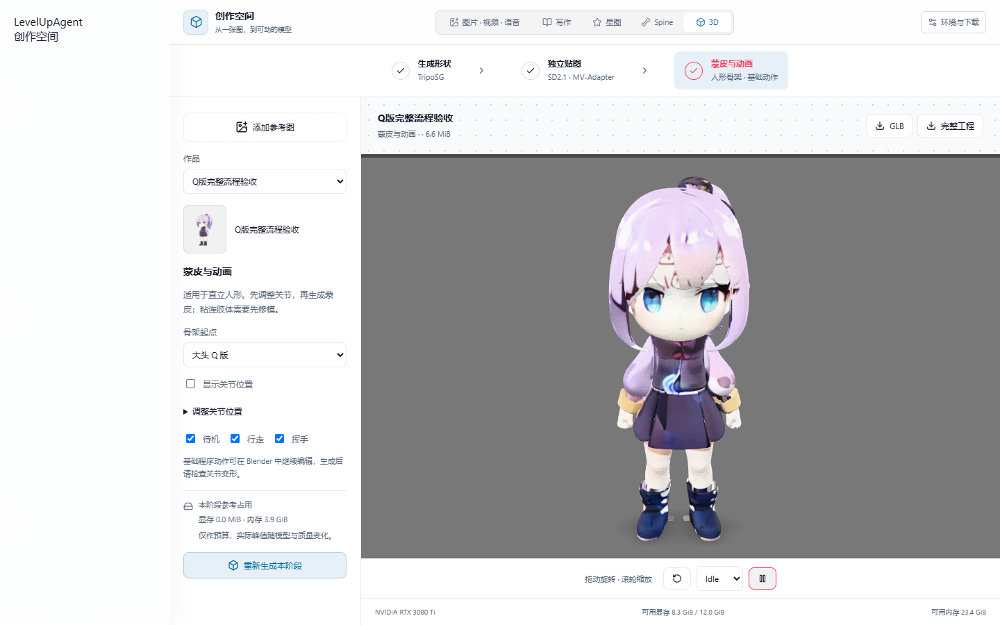

# 3D 模型工作台

入口：**创作空间 → 3D**。三个阶段分别执行，切换创作空间不会停止后台任务。

1. **TripoSG 生成形状**：输入透明 PNG 或纯白背景图片，生成原始高精度网格和默认 30,000 面灰模。默认精细档（50 步、octree depth 9）；显存较少时可选快速档（30 步、depth 8）。纯白背景模式仅处理已经整理过的白底图，不包含自动抠图模型。
2. **SD2.1 独立贴图**：保留网格形状，展开 UV，使用 MV-Adapter 的图像和几何条件生成六视角，再投影到 1K / 2K 颜色贴图。默认顺序 CPU 卸载。重做贴图不重新推理形状。
3. **蒙皮与动画**：常规人形 / 大头 Q 版骨架起点、可调整的关节位置、Blender 自动权重、最多四骨影响、待机 / 行走 / 挥手基础动作。热权重直接求解失败时，在临时体素代理上求解并传回原始网格，保留原表面与 UV。可预览动作并分别导出 GLB、FBX，或导出包含 Blender 工程、参数及检查报告的 ZIP。

每次运行写入新的目录。阶段成功才更新当前作品，失败或取消不会覆盖上一次成功结果。重做上游阶段成功后，当前作品的下游结果失效，旧运行文件仍保留。所有推理使用本地资源，生成过程中不访问 Hugging Face。

## SD2.1 / SDXL 实测对比

2026-10-09 对同一 Q 版参考图、同一灰模 / UV、种子 42、30 步、512px 六视角、2K 贴图、顺序 CPU 卸载做了对比。

| 颜色生成阶段 | SD2.1 | SDXL |
| --- | ---: | ---: |
| 用时（包含模型载入） | 82.77 秒 | 205.00 秒 |
| PyTorch 显存保留峰值 | 2,166 MiB | 3,224 MiB |
| 此样例的主要差异 | 增加红色衣襟、蓝色靴饰，袖部出现不一致色块 | 服装配色、金色饰边、靴子更接近参考图 |

当前工作台按指定工作流只分发 SD2.1；SDXL 仅作为历史对照样例保留。以上是单个角色样例的比较，不代表所有输入的质量或速度排序。PyTorch 数字不包含 GPU 驱动、其他进程和全部非 Torch 分配。


详细指标见 [comparison-results.json](model-workbench/comparison-results.json)。SD2.1 官方旧地址返回 401，本次明确使用固定版本的 `sd2-community/stable-diffusion-2-1-base` 归档，全部权重使用 safetensors 并核对模型仓库 LFS SHA-256。

## 运行环境与资源提示

- 本版本目标：NVIDIA CUDA GPU，Windows WSL2 或 Linux x64。Windows 需已有可运行 `python3` 的 WSL2 Linux 发行版，建议 Ubuntu 22.04 或更新版本。启动器使用默认发行版。macOS 显示平台提示，不假装支持 CUDA。
- 建议 12 GiB 显存、32 GiB 内存。显存显示第一张 CUDA 显卡的当前空闲量；内存与磁盘显示实际 Linux / WSL 环境内的可用量。WSL 的内存限额可能低于 Windows 物理内存。
- 形状精细 / 快速档的显存预算分别约 10.3 / 4.4 GiB；贴图 / 蒙皮分别约 5.9 / 0 GiB。形状 / 贴图 / 蒙皮的内存预算为 17.6 / 13.7 / 3.9 GiB。这些是预算提示；运行后另显示实测阶段耗时与 PyTorch 峰值。
- 大组件不进入 Tauri 安装包。应用只携带启动器、工作脚本及本地 3D 查看器。
- Python / PyTorch / CUDA、TripoSG、SD2.1 + MV-Adapter、Blender 可以按阶段安装。操作前显示下载大小、安装占用和临时空间。下载显示字节、速度、进度和估算剩余时间；取消后保留可续传部分。
- 模型文件体积较大，安装时需要容纳下载分片、合并归档和解压结果。界面按实际清单计算，安装器在写入前再次检查磁盘。

资源目录：`$XDG_DATA_HOME/levelup-agent/model-workbench/resources/<资源版本>/linux-x64-cu118`，未设置 XDG 时位于 `~/.local/share`。同一资源版本由不同应用版本共用，应用升级不会重新下载。作品保存在桌面应用数据目录的 `model-workbench/projects`，与依赖分开。

## 发布资源

从应用 1.2.71 起，所有大资源统一放在固定的 `model-workbench-resources` Release，资源版本独立于应用版本。当前资源版本为 `2026.10.1`，下载地址：

```text
https://github.com/TippingGame/LevelUpAgent/releases/download/model-workbench-resources/model-workbench-2026.10.1-linux-x64-cu118.json
```

`modules/model_workbench/resources.json` 固定兼容的资源版本、Release tag、平台与 CUDA。schemaVersion 2 清单声明独立的 `resourceVersion`、各组件许可和固定来源、分片大小 / SHA-256、完整归档 SHA-256、解压后大小。客户端拒绝不兼容资源，不访问应用 `latest`。资源 Release 标记为 prerelease 且非 Latest，避免影响应用自动更新；此标记仅用于渠道隔离。

日常应用发布只修改应用版本，不修改资源版本、不重复打包或上传模型。只有依赖内容改变时才升级 `resourceVersion`，在同一个 Release 添加新名称的分片和清单，保留旧资产。已发布的文件不可覆盖；相同哈希的资产直接复用。清单最后上传，确保用户看到清单时全部分片已就绪。离线导入也使用相同的带资源版本清单。

`scripts/package-model-workbench.py` 从准备好的四个组件目录生成清单和每片小于 2 GB 的 Release 文件：

```text
staging/
  runtime/
    python/                  # conda-pack 生成、尚未 conda-unpack 的可迁移环境
    cuda/                    # 固定 CUDA 11.8 编译工具和 redistributable 库 / 头文件
    vendor/TripoSG/           # fc5c40990181e2a756c4e0b1c2f4d6b5202faf8c
    vendor/MV-Adapter/        # 4277e0018232bac82bb2c103caf0893cedb711be + 已记录补丁
    requirements.lock.txt
    provenance.json
  triposg/                   # 固定权重 2c1c516d22d58db486a058d98d31bb6177344e06
    model_index.json
    ...
    provenance.json
  texture/
    base/                    # SD2.1 base fp16 diffusers safetensors + LICENSE-MODEL
    adapter/                 # mvadapter_ig2mv_sd21.safetensors + LICENSE
    provenance.json
  blender/                   # Blender 3.6.23 Linux x64 官方二进制目录
    blender
    ...
    provenance.json
```

每个 `provenance.json` 至少包括 `license` 和 `sources`。保留上游代码、权重及二进制发行版的 LICENSE / COPYING 文件。Blender 的对应源代码地址也要随分发清楚提供。不能把研究项目中的 RMBG、LGM 或非商业高斯光栅化依赖带入这套资源。

本次运行环境使用 Python 3.10、Torch 2.5.1+cu118、diffusers 0.32.2；依赖锁文件及构建说明位于 [packaging/model-workbench](../packaging/model-workbench/README.md)。安装运行环境后才在最终安装位置执行 `conda-unpack`，不能把已经解包定位过的环境当作可迁移包重新分发。

```powershell
python scripts/package-model-workbench.py --staging <准备好的目录> --output artifacts/model-workbench/release
node scripts/upload-model-workbench.mjs artifacts/model-workbench/release
```

上传脚本重新校验全部分片和完整归档；首次创建固定资源草稿，之后复用同一 Release，跳过相同内容、拒绝同名不同内容，并核对 GitHub digest。初次核验后显式执行 `gh release edit model-workbench-resources --draft=false --prerelease --latest=false`。以后可直接向该资源 Release 添加新的独立资源版本。也可手动运行 `3D workbench resources` workflow，使用带 `model-workbench` 标签的 Linux 自托管发布机以及仓库变量 `MODEL_WORKBENCH_STAGING`；该工作流不随应用 tag 自动运行。

离线安装：将清单和全部所选组件分片放在同一个目录，在工作台点击「环境与下载 → 离线导入」。同样执行版本、大小、哈希及归档路径检查。

## 生命周期与验证

桌面桥接只允许固定的 status / manifest / install / generate 操作。生成进程按阶段隔离，不同时驻留 TripoSG 和 SD2.1。取消终止整个 Linux 工作进程组；桌面进程消失后，心跳租约过期也会停止工作进程。重启后将遗留运行状态显示为中断。

标准检查：`pnpm check`、`pnpm build`、`cargo test --manifest-path src-tauri/Cargo.toml model_workbench --lib`、`python -B -m unittest discover -s modules/model_workbench/tests -v`。Linux / WSL 另外执行进程组取消测试。CI 已接入安装器测试。

本地验证图片和日志保存在 `artifacts/model-workbench/`。四种外观（系统浅 / 深色 × 装甲关 / 开）的浏览器布局、错误面板和 720px 窗口已检查，另在真实 Tauri 窗口检查创作入口、环境面板及显存 / 内存查询。

### 本次端到端验收

2026-10-09，在 RTX 3080 Ti 12 GiB、WSL2 上，从本地 Release 分片安装全部四个组件，完成 conda 环境迁移、`pip check` 和无既有编译缓存的 nvdiffrast 首次编译。首次完整验收使用历史 SDXL 资源（18 个分片，约 28.6 GiB）；当前 SD2.1 清单为 14 个分片，约 21.7 GiB，Windows NSIS 安装包约 14 MiB，不包含这些大组件。

历史 SDXL 全流程使用同一单角色透明参考图，形状精细档 50 步、贴图 30 步、种子 42、512px 六视角、2K 贴图、顺序 CPU 卸载、大头 Q 版骨架，连续完成三个阶段。形状阶段约 52.5 秒、Torch 显存保留峰值 10,392 MiB；SDXL 贴图约 114.7 秒、峰值 3,960 MiB。这次计时使用已编译的扩展，不能与前面的 SDXL / SD2.1 配对实验直接比较速度。

当前 SD2.1 分片经离线导入和哈希校验后，在同一 RTX 3080 Ti / WSL2 环境运行精细档完整流程。生成 30,000 面灰模，贴图模型保留同一表面位置（最大偏差 0）、包含 UV 和 2K 颜色贴图；贴图阶段约 62.4 秒、Torch 显存保留峰值 2,356 MiB。蒙皮结果有 19 根骨骼、1 个 skin、Idle / Walk / Wave 三个动作，0 个无权重顶点；浏览器中的三个动作均可播放。数据见 [SD2.1 全流程验收](model-workbench/sd21-pipeline-acceptance.json)。



生成 30,000 三角面的模型；贴图阶段最大表面位置偏差为 0；蒙皮输出 19 根骨骼、1 个 skin、3 个动作、0 个无权重顶点，权重和最大误差为 `2.22e-16`。实际 GLB 在工作台查看器中载入，并检查 Idle / Walk / Wave 均能播放。四种外观的 720px 验证包含 244px 应用侧栏。真实 Tauri 的整条导入 / 预览 / 导出 UI 链路尚未完整自动验收；上述 GPU 生成通过桌面使用的同一 Python 启动器和资源完成。

详细结果见 [pipeline-acceptance.json](model-workbench/pipeline-acceptance.json)。本地示例交付物位于 `artifacts/model-workbench/delivery/`；原始验收资源位于 `artifacts/model-workbench/release/`，通用资源发布集位于 `artifacts/model-workbench/release-shared/`。应用及资源发布状态见 [1.2.71 发布记录](RELEASE_1.2.71.md)。


## 已知边界

贴图输出是 RGB 外观，可能带有绘制的光照；不是完整物理材质。不可见区域采用明确记录的最近有效纹素补齐。蒙皮针对可辨识、肢体分开的直立人形，基础动作不是动捕，也不是通用 AI 自动绑定。自动检查确保骨骼、动作、权重与 GLB 结构存在；美术质量、肢体粘连和动作变形仍需查看结果。当前新工作台输出不声称已经完成 Unity / Unreal 导入验收。

此次样例中，挥手仍会带动靠近手臂的部分裙摆，说明自动权重不能代替服装权重修整；可在导出的 Blender 工程中继续修正。当前资源中的 diso 使用 `8.6+PTX` 编译配置，已验证 RTX 3080 Ti；更老 GPU 需要对应架构的扩展构建，RTX 50 系列应使用更新的 CUDA / PyTorch 资源目标。
